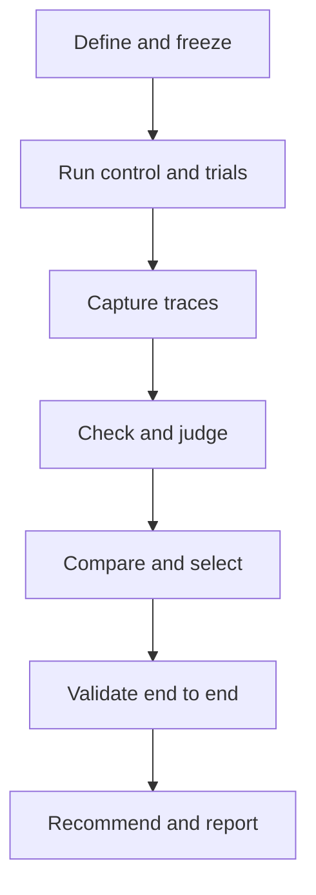
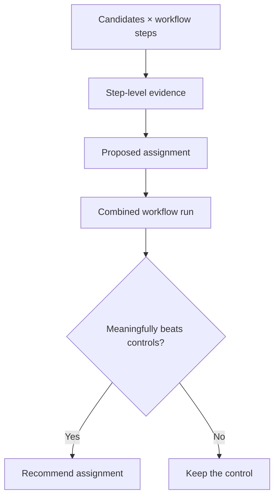

# Agent Evaluation Protocol

**Version:** 0.4  
**Status:** Draft  
**Purpose:** A short, implementation-neutral specification for evaluating complete agent workflows and choosing the right model, provider, prompt, and workflow configuration for each step.

## 1. What this protocol is for

An agent workflow often contains several different kinds of work: understanding a request, planning, retrieving information, using tools, generating an artifact, checking the result, and recovering from errors. The best model for one step may not be the best model for another.

This protocol provides a repeatable way to answer four questions:

1. Does the workflow complete the task correctly and safely?
2. Which model and configuration work best for each step?
3. Among the acceptable options, which provider delivers the best cost and completion time?
4. Can another person reproduce the result from the recorded evidence?

It does not produce a universal model leaderboard. Every recommendation applies to a defined workflow step, test set, operating mode, and evaluation version.

## 2. Core principles

### Quality must qualify

A candidate must first meet required correctness, safety, reliability, and policy conditions. A faster or cheaper candidate cannot compensate for failing a required condition.

### Keep important measures separate

Do not make a single weighted score the official result. Report at least:

- task success;
- required-check pass rate;
- reliability;
- first-pass success and autonomous completion rates;
- judged quality;
- retries and human interventions;
- cache use;
- cost per successful task; and
- completion time, including the 50th and 95th percentiles when the sample is large enough.

### Evaluate the workflow, not only the final answer

Record the decisions, tool calls, intermediate artifacts, retries, checkpoints, and final output. A plausible final answer can hide an inefficient or unsafe process.

### Prefer comparative evidence for subjective quality

When quality cannot be fully checked with deterministic rules, compare outputs directly and score clearly defined dimensions. Calibrate automated judges against expert human judgments before relying on them.

### Make uncertainty visible

Small or inconsistent samples should produce a directional result, not false precision. A report must distinguish failure, evaluator error, and “not evaluated.”

## 3. What must be defined before a run

### Workflow-step definition

A **workflow step** is a versioned logical unit of work with a defined input contract, output contract, success criteria, permitted tools, execution boundary, and evaluator set. Tool calls, model messages, retries, and checkpoints inside that boundary are execution events, not workflow steps. If any contract or boundary changes materially, the step version changes.

This distinction makes step success, handoff loss, retry counts, cost, and model selection comparable across candidates. Implementations may expose finer-grained trace spans, but they must not silently reinterpret those spans as workflow steps.

Each workflow step must have a versioned evaluation specification containing:

| Required item | Plain-language meaning |
|---|---|
| Task | What the step is expected to do. |
| Goal | The outcome that matters to the user or business. |
| Context | Information, tools, permissions, and prior-step outputs available to the step. |
| Target behavior | What a strong process and output look like. |
| Failure modes | Known ways the step can be wrong, unsafe, incomplete, inefficient, or misleading. |
| Test cases | Representative normal cases, difficult cases, edge cases, and known failures. |
| Success criteria | The explicit rule for task success, including mandatory requirements and any minimum judged-dimension thresholds. |
| Required checks | Mandatory or measured conditions such as schema validity, compilation, citation verification, policy compliance, or field-level accuracy. |
| Judged dimensions | Qualities that require calibrated human or model judgment, such as reasoning quality, usefulness, business grounding, or visual design. |
| Operating constraints | Cost ceiling, completion-time ceiling, privacy rules, and permitted tools. |
| Candidate | A model, provider, prompt, tool configuration, and generation settings treated as one testable option. |

Changing any material item creates a new evaluation version.

### Outcome and operating definitions

The following definitions are normative:

- **Trial outcome:** success when all declared success criteria are satisfied, failure when a criterion is demonstrably not satisfied, and undetermined when a mandatory criterion has an evaluator error or was not evaluated. Implementations must not infer success from an average score.
- **Candidate eligibility:** the candidate satisfies every aggregate eligibility rule declared for the step, such as minimum reliability, mandatory-check thresholds, disqualifying failure limits, and operating ceilings. Trial outcome and candidate eligibility are related but not interchangeable.
- **Task-success rate:** successful trials divided by all classified trials. Classified trials are successes plus candidate-caused failures; undetermined trials are excluded and reported through evaluation coverage.
- **Reliability:** successful trials divided by all classified valid candidate attempts. Refusals, timeouts, malformed outputs, cancellations, and other non-transport candidate failures remain in the denominator. Evaluator errors are excluded and reported separately; evaluation coverage is classified attempts divided by valid candidate attempts.
- **First-pass success rate:** tasks that satisfy the success criteria before any candidate-level recovery attempt divided by all valid first attempts.
- **Autonomous completion rate:** valid attempts completed without human intervention during execution divided by all valid candidate attempts.
- **Human intervention:** a person supplies information, approval, correction, or an action required for execution to continue. Human evaluation after execution is not an intervention.
- **Required-check pass rate:** passed required-check instances divided by all completed required-check instances. Report mandatory-gate eligibility separately so optional checks cannot hide a mandatory failure.

Reliability must be accompanied by separate timeout, refusal, malformed-output, cancellation, provider-error, and evaluator-error rates. Every reported rate must state its numerator, denominator, and treatment of missing results.

### Cost accounting

Record cost in separate components whenever available:

- candidate generation;
- tool and external-service use;
- evaluation and judging;
- infrastructure;
- retries and recovery; and
- total system cost.

Report both cost per valid attempt and cost per successful task. Cost per successful task is total system cost divided by the number of successful tasks; it is undefined when no task succeeds. Estimated or imputed costs must be labeled and must not be mixed silently with provider-reported charges.

## 4. Configuration and selectable settings

An evaluation is defined by one versioned, human-readable configuration file. The interface may generate this file through a guided form, but the saved configuration is the reproducible source of truth.

Users can select or define the following:

| Configuration area | Selectable settings |
|---|---|
| Workflow scope | Workflow, included steps, step order, and the simple end-to-end control. |
| Test data | Test-set version, included cases, sampling rules, data split, and protected holdout cases. A holdout case is reserved for final validation rather than routine tuning. |
| Candidates | Model, inference provider, system prompt, generation settings, reasoning setting, context limit, tools, and the workflow steps the candidate may perform. |
| Trial plan | Repetitions per case, random seed when supported, parallel-run limit, total spending limit, and stopping rules. |
| Evaluation methods | Required checks, direct comparisons, dimension rubrics, question-based checks, automated judges, and human reviewers. |
| Eligibility | Required-check thresholds, minimum reliability, disqualifying failure modes, and maximum completion time when applicable. |
| Operating mode | Lowest cost among eligible candidates, fastest candidate within a cost ceiling, or highest assurance within cost and time ceilings. |
| Benchmark mode | Capability-neutral or production-realistic. Capability-neutral mode disables candidate-specific optimizations where feasible; production-realistic mode permits deployable features such as prompt caching, batching, and routing. |
| Cache testing | Cold cache, warm cache, or both; cache namespace; and the production-representative request sequence used for warm-cache tests. Cache results must be reported by mode rather than pooled. |
| Long-running behavior | Maximum run time, checkpoint triggers, resume policy, permitted replacement models, and maximum recovery attempts. |
| Data handling | Execution location, permitted endpoints, redaction policy, retention period, and what the client-facing report may reveal. |
| Reporting | Internal evidence view, client view, audit view, comparison run, and uncertainty requirements. |

### Minimal configuration example

The following uses YAML, a human-readable configuration format. It is illustrative; implementations may also accept an equivalent structured format.

```yaml
protocol_version: "0.4"
run_name: "product-requirements-and-code-handoff"
budget_usd: 100

workflow:
  control_candidate: "single-model-control"
  steps:
    - id: "requirements"
      task_file: "tasks/requirements.md"
      test_set: "test-data/requirements-v3"
      candidate_ids: ["candidate-north", "candidate-east"]
      required_checks: ["evidence-trace", "scope-consistency"]
      judged_dimensions: ["business-grounding", "causal-strength", "usability"]
      success_criteria:
        mandatory_checks: "all"
        minimum_dimension_scores:
          business-grounding: 0.80
      operating_mode: "highest-assurance"

    - id: "code-handoff"
      task_file: "tasks/code-handoff.md"
      test_set: "test-data/code-handoff-v2"
      candidate_ids: ["candidate-east", "candidate-west"]
      required_checks: ["compilation", "automated-tests", "security-policy"]
      success_criteria:
        mandatory_checks: "all"
      maximum_completion_time_seconds: 120
      operating_mode: "lowest-cost-within-time-limit"

candidates:
  - id: "candidate-north"
    model: "provider/model-name"
    provider_route: "primary-route"
    prompt_file: "prompts/north.md"
    generation_settings:
      temperature: 0.2

execution:
  trials_per_case: 3
  benchmark_mode: "production-realistic"
  cache_mode: "both"
  resume: true
  checkpoint_after_each_step: true

reporting:
  views: ["internal", "client"]
  redact_raw_client_data: true
```

Currency in `budget_usd` is United States dollars. The identifiers are stable names defined by the user; they do not reveal vendor names to judges.

## 5. Contracts

Contracts allow the runner, workflow, models, evaluators, and reports to change independently.

### Candidate adapter contract

Every model or provider adapter accepts a normalized request containing:

- task and step identifiers;
- input and permitted context;
- available tools and permissions;
- prior-step outputs;
- generation settings; and
- an optional checkpoint to resume.

It returns:

- response content and produced artifacts;
- completion state: success, refusal, timeout, malformed output, cancelled, or provider error;
- token and provider-reported usage when available;
- start time, first-response time, and completion time;
- cache information when available;
- model and provider-route identifiers;
- a resumable checkpoint when supported;
- execution interventions, including type, trigger, actor, and elapsed time; and
- structured error details without secrets.

Provider-specific fields may be retained as metadata, but the required normalized fields must remain portable.

### Evaluator contract

Every evaluator accepts the step specification, test case, candidate output, and relevant trace. A comparative evaluator also receives the other anonymized output.

It returns:

- result state: pass, fail, not evaluated, or evaluator error;
- numerical score when the method supports one;
- comparison result when applicable: first output, second output, or tie;
- cited evidence from the output or trace;
- explanation and confidence;
- evaluator name and version; and
- whether human review is required.

An evaluator error must never be converted into a candidate failure.

### Checkpoint contract

A checkpoint contains completed work, current plan, remaining work, artifacts, evidence provenance, tool state, assumptions, unresolved questions, budget use, elapsed time, privacy labels, and a format version. Another compatible model must be able to validate the checkpoint before resuming.

### Required-check contract

A deterministic required check receives the step specification, test case, output artifacts, and permitted trace fields. It returns pass, fail, not evaluated, or evaluator error; optional continuous measurements; evidence; and its implementation version.

### Success-decision contract

A success decision receives all declared success criteria and their required-check and judged-dimension results. It returns success, failure, or undetermined; cites every criterion used; and records the decision-rule version. “Undetermined” is required when a mandatory criterion has an evaluator error or is not evaluated. It must not be coerced to success or failure in official rates; reports show it separately through evaluation coverage and evaluator-state rates.

## 6. Evaluation methods

Use the smallest combination of methods that measures the property reliably.

### Deterministic checks

Use executable checks for properties with a clear answer. Examples include valid structured output, compilation, test completion, exact field extraction, citation resolution, file integrity, and policy rules.

Required checks act as eligibility gates. Their result is pass, fail, evaluator error, or not evaluated.

### Direct comparison

For subjective differences, show two anonymized outputs for the same test case and ask which better satisfies the stated criteria. Reverse their display order to detect position bias. Allow a tie when the difference is not meaningful.

### Rubric-based scoring

Score clearly defined dimensions on a continuous scale with behavioral anchors. Do not ask for an unexplained overall score. For example, business grounding can measure the proportion of material recommendations supported by supplied evidence and the strength of the causal link to an intended business outcome.

### Question-based checks

Turn requirements into answerable questions, such as “Does every proposed feature map to a stated user problem?” Record the answer, supporting evidence, and confidence.

### Human review

Use expert review for high-risk decisions, novel failure modes, and taste-dominated outputs. Human review is also the reference used to calibrate automated judges.

Human review during evaluation is distinct from human intervention during candidate execution. The former affects evaluator evidence and cost; the latter affects autonomy measures and must appear in the execution trace.

### Statistical comparison

Compare candidates on the same test cases whenever possible. Use paired analysis for paired observations, report an effect size and uncertainty interval, and define the minimum meaningful difference before viewing results. A statistically detectable difference smaller than that threshold is not sufficient to recommend switching candidates.

Randomize or balance candidate order, judge presentation order, and run order where they may introduce bias. When repeated trials are nested within test cases, do not treat every trial as an independent case. If sample size is inadequate, label the result directional and show the observed variation rather than claiming a winner.

## 7. Execution lifecycle

1. **Validate configuration.** Confirm that referenced steps, candidates, test sets, checks, credentials, limits, and report permissions exist. Reject contradictory or unsafe settings.
2. **Preview the run.** Show the planned number of generations, judgments, required checks, estimated spending range, and expected data destinations before execution.
3. **Freeze the run.** Write the immutable run manifest containing workflow, prompt, model, provider, tool, data, evaluator, threshold, and infrastructure versions.
4. **Run the control.** Test the simple baseline, including one strong model used for the entire workflow when model switching is being considered.
5. **Generate repeated trials.** Run each candidate on the same test cases. Retain timeouts, refusals, malformed responses, cancellations, and failed attempts as results.
6. **Checkpoint and resume.** Save results after each completed unit. Restarting with resume enabled must skip work already completed under the same content hash.
7. **Capture the trace.** Store step inputs and outputs, tool calls, retries, checkpoints, token use, cache state, cost, and timing.
8. **Apply required checks.** Eliminate candidates that do not meet defined eligibility thresholds.
9. **Judge eligible outputs.** Use direct comparisons, dimension scores, question-based checks, or human review as appropriate.
10. **Estimate uncertainty.** Compare candidates on matched cases, calculate the declared effect size and uncertainty interval, and test against the predeclared minimum meaningful difference. Use a clear directional warning when the sample is inadequate.
11. **Choose by operating mode.** Among eligible candidates, apply the declared priority: lowest cost, lowest completion time under a cost ceiling, or highest assurance.
12. **Compare end to end.** Confirm that the proposed combination of models beats the simple control after handoff, caching, and routing overhead are included.
13. **Render approved views.** Produce machine-readable evidence plus internal, client, or audit views according to the reporting policy.

The execution and evidence flow is:



Only transport failures may be retried automatically without counting as a completed candidate attempt. Other failures remain part of the measured result. When the spending or time limit is reached, the run stops cleanly and records incomplete work rather than silently discarding it.

## 8. Selecting different models for different steps

Switching models can help when steps require meaningfully different capabilities or economics. It should be adopted only when the end-to-end evidence supports it.

Use three distinct phases:

1. **Evaluate:** run every configuration on every applicable workflow step using the same test cases and repetitions. A configuration is one model, provider route, prompt, tool setup, and set of generation settings. Do not pre-assign configurations to steps based on assumptions.
2. **Select:** use the step-level evidence to propose a configuration for each step. This may result in one configuration handling every step or different configurations handling different steps.
3. **Validate:** run the proposed combined workflow from beginning to end. Compare it with each single-configuration workflow and the current production workflow.



For example, if configurations A, B, and C can perform the steps understand, plan, execute, and verify, the evaluation phase contains twelve tested cells: three configurations multiplied by four steps. Only after those tests might the proposed workflow select A for understanding, B for planning, C for execution, and A for verification.

For every handoff between models, define:

- the permitted input and output fields;
- provenance for facts and retrieved evidence;
- uncertainty and unresolved issues;
- size limits and compression rules;
- privacy classification; and
- how an interrupted step is resumed.

Measure the additional cost, completion time, translation loss, cache disruption, and operational complexity introduced by the switch. Keep the single-model control if the improvement is not meaningful or repeatable.

Do not conclude that a step-level combination is superior until the end-to-end validation shows an improvement at least as large as the predeclared minimum meaningful difference under the intended operating mode.

## 9. Non-deterministic and multimodal work

Tasks such as product-requirements writing, contextual answering, interface design, image generation, and video generation need layered evaluation.

Use this order:

1. artifact validity and safety;
2. required content and factual adherence;
3. task-specific consistency, such as character identity or frame-to-frame continuity;
4. technical quality;
5. calibrated quality or taste judgment; and
6. cost and completion time.

For video, evaluate prompt adherence at specified time ranges rather than only at the clip level. Compare only outputs that pass validity and safety checks. Use multiple blinded reviewers for overall design quality, record disagreement, and do not present aesthetic preference as objective truth.

## 10. Long-running tasks and checkpoints

A long-running task must have named checkpoints. Each checkpoint stores:

- completed work and produced artifacts;
- current plan and remaining work;
- tool state and external references;
- decisions, assumptions, and unresolved questions;
- budget and elapsed time; and
- a versioned format that another compatible model can resume.

Test more than final completion. Interrupt trials at planned points, resume them with the same and a different model, and measure recovery success, duplicated work, lost information, and added cost and time.

## 11. Client-hosted evaluations

The evaluation runner should be able to execute inside a client-controlled public or private cloud environment. The client provides:

- a callable workflow or packaged runner;
- representative data approved for evaluation;
- expected behavior, known failure modes, and subject-matter reviewers;
- credentials supplied through the client’s secret manager; and
- rules governing which evidence may leave the environment.

Raw client data should remain in the client environment by default. Export only an approved report view, such as aggregate measures, redacted examples, decision traces, and unresolved risks. Keep internal evaluator diagnostics and raw traces in a more restricted view.

Repeatability requires pinned versions, content hashes, fixed test-set identifiers, recorded infrastructure and provider settings, and an immutable run manifest.

## 12. Output contract

Every run produces a versioned run directory or equivalent object-store prefix containing:

1. a manifest describing exactly what was tested;
2. raw and normalized trial records;
3. checkpoints and recovery records;
4. required-check and judge records with evidence;
5. a per-step result table;
6. an end-to-end workflow comparison;
7. a recommendation with its decision trace;
8. uncertainty, limitations, and unresolved risks;
9. a change report when compared with a prior run; and
10. approved human-readable report views.

The machine-readable report is canonical. A common representation is JavaScript Object Notation, usually stored with a `.json` filename. Human-facing reports are controlled views derived from the canonical record.

### Minimum per-trial record

Each trial record contains the run, workflow, step, test case, candidate, and trial identifiers; timestamps; completion state; normalized output references; trace references; required-check and success-decision results; usage and itemized cost; cache and benchmark modes; retry history; human interventions; checkpoints; and errors.

### Minimum per-step result

Each per-step result contains eligibility and reasons; task-success and required-check rates; reliability; first-pass success and autonomous completion rates; failure-state rates; comparative judgments; continuous dimension measurements; itemized cost per attempt and successful task; completion-time distribution; retry and intervention counts; cache results separated by benchmark mode; effect sizes; uncertainty; minimum meaningful differences; and the recommended candidate for each operating mode.

### Recommendation trace

The recommendation trace lists each filter and comparison in order, every candidate removed and why, the remaining trade-offs, the selected operating mode, the final choice, and whether the result is firm, directional, or requires human review.

### Report views

- **Internal evidence view:** complete traces, raw examples, evaluator diagnostics, and debugging data.
- **Client view:** approved aggregate measures, redacted examples, recommendation logic, limitations, and risks.
- **Audit view:** immutable manifest, hashes, versions, decision trace, approvals, and policy events.
- **Change view:** differences in configuration, evidence, performance, and recommendations between two runs.

## 13. Minimum viable implementation

The first usable version must support:

- text, code, and structured-data workflow steps;
- model- and provider-independent adapters;
- deterministic checks and calibrated model judgments;
- repeated trials and uncertainty reporting;
- paired candidate comparison on the same cases;
- explicit success decisions and eligibility gates;
- itemized cost, timing, reliability, first-pass success, retry, and intervention measurements;
- restartable runs that skip completed trials with matching content hashes;
- a single-model end-to-end control;
- versioned manifests and comparisons between runs.

A practical first validation is two candidates across ten representative tasks with three trials per task. It must produce traces, deterministic results, judged results, aggregate comparisons, and a reproducible recommendation.

Cross-model checkpoint resume, warm-cache optimization, client-hosted execution, redacted export, and video or other multimodal evaluators are compatible extensions, but are not required for the first usable version. They must use the same artifact, trace, success, cost, and scoring contracts when added.

## 14. Conformance

An implementation conforms to this protocol when it can:

- read a versioned step specification;
- apply the normative workflow-step and success definitions;
- preserve all required result states;
- apply eligibility gates before cost or speed optimization;
- retain separate outcome and operating measures;
- distinguish human intervention from human evaluation;
- compare matched candidates with declared uncertainty and meaningful-difference rules;
- reproduce a recommendation from the stored evidence; and
- export a machine-readable run bundle without requiring a particular model, provider, gateway, or evaluation framework.

## 15. What the protocol deliberately does not decide

The protocol does not require one evaluation framework, model gateway, inference provider, judge model, storage system, or hosting platform. Those are replaceable implementation choices. It also does not claim that one model is universally best or that subjective quality can be reduced to an objective truth.

---

This short specification is derived from the broader agent-evaluator implementation plan. The implementation plan remains the source for detailed architecture, tooling comparisons, security controls, rollout milestones, and task-specific examples.
