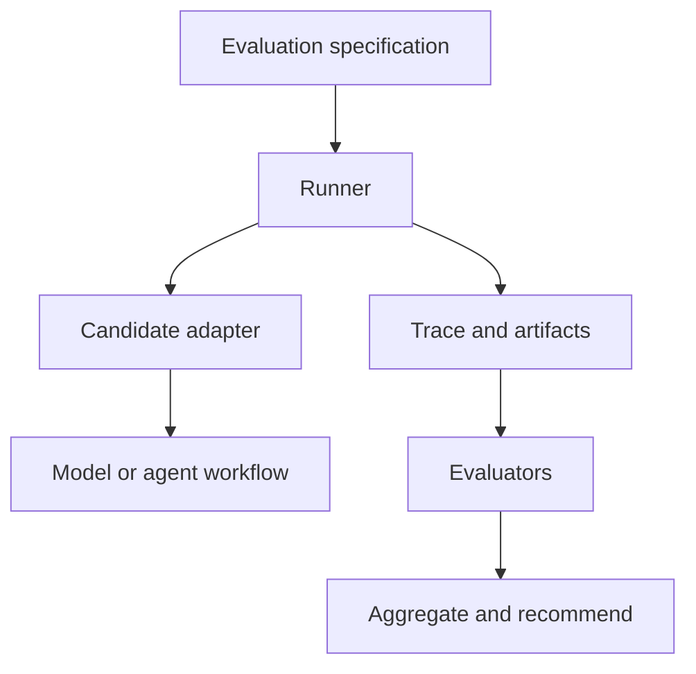
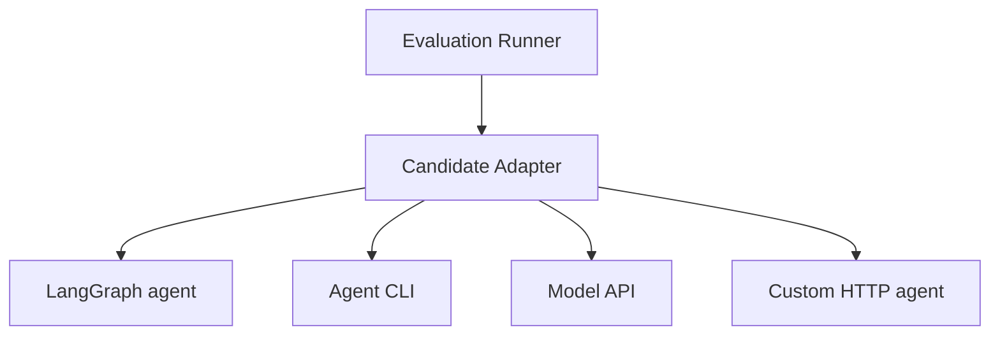
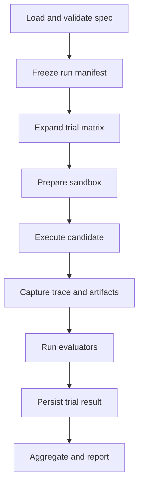
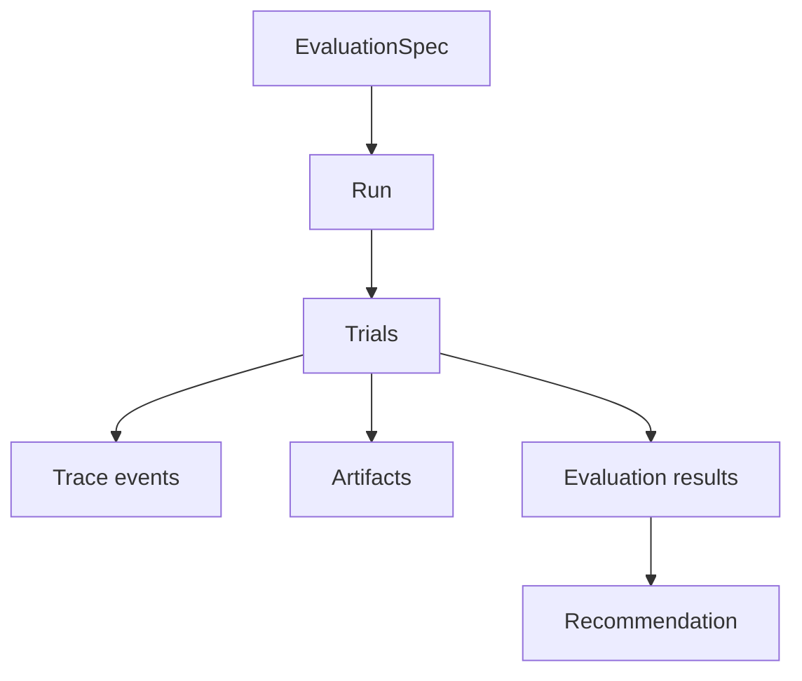
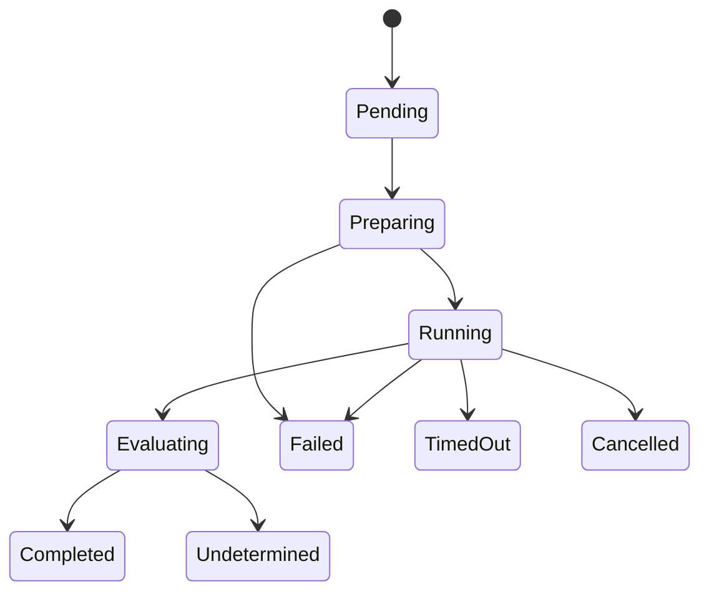
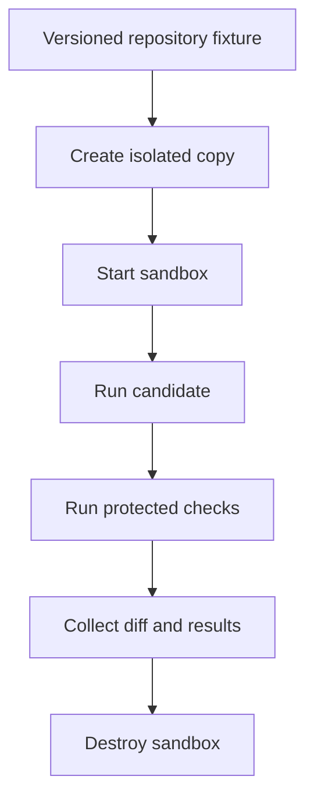

# Self Hosted Evaluation Runner V1 Implementation Design

**Version:** 0.1  
**Status:** Draft  
**Governing specification:** Agent Evaluation Protocol v0.4

## 1. Purpose and conclusion

This document defines the first implementation of a self-hosted runner for evaluating agent workflows. The runner executes the same test cases against multiple candidate configurations, captures reproducible evidence, invokes evaluators, and produces comparable results.

The V1 recommendation is a small TypeScript runner with a command-line interface, SQLite storage, local artifact storage, Docker-based isolation for code tasks, and replaceable adapters. It should not depend on LangGraph. LangGraph agents may be evaluated through a candidate adapter, and LangGraph may be introduced later for complex human-review workflows.

The first usable validation target is:

```text
2 candidates × 10 representative tasks × 3 trials
```

The runner must answer a concrete question: among candidates that satisfy declared quality, safety, and reliability requirements, which configuration offers the best cost and completion time for the tested workflow?

## 2. Scope

### Included in V1

- text, code, and structured-data tasks;
- versioned YAML or JSON evaluation specifications;
- candidate, evaluator, sandbox, artifact, and storage adapters;
- repeated trials on matched test cases;
- deterministic checks and one LLM-judge integration;
- isolated code-task execution;
- timeout, cancellation, concurrency, and spending limits;
- normalized trace, usage, cost, retry, and intervention records;
- restartable runs using content hashes;
- machine-readable results and a static human-readable report;
- single-candidate and single-model controls.

### Deferred

- graphical evaluation-design studio;
- adaptive production routing;
- provider-gateway qualification;
- warm-cache optimization;
- cross-model checkpoint resume;
- reusable client-hosted execution plane;
- video and other specialized multimodal evaluation;
- distributed scheduling and Kubernetes;
- real-time dashboard and collaborative review.

## 3. System boundary

The runner is an experiment execution system, not an agent framework and not the final decision maker.

| Component | Responsibility |
|---|---|
| Evaluation specification | Defines tasks, candidates, trial plan, checks, thresholds, and limits. |
| Runner | Executes trials reliably and records normalized evidence. |
| Candidate | The model, prompt, tools, settings, provider, or agent workflow being tested. |
| Evaluator | Determines whether declared requirements were satisfied. |
| Aggregator | Calculates rates, distributions, uncertainty, and operating metrics. |
| Selector | Applies eligibility gates and operating-mode rules to produce a recommendation. |



Candidate planning, tool selection, memory, and business logic remain inside the evaluated candidate. The runner must not silently improve one candidate by supplying logic that another candidate does not receive.

## 4. LangGraph decision

LangGraph is not required for the Runner V1 core. Its primary value is graph-based agent execution, checkpointed graph state, interrupts, human-in-the-loop workflows, and recovery at graph boundaries. The runner instead needs experiment-matrix expansion, isolation, budgets, trial accounting, evaluator invocation, and comparable reporting.

The recommended dependency direction is:



Use LangGraph when the candidate itself has branching, loops, persistent state, or approval points. Add a `LangGraphCandidateAdapter` without changing the runner contracts. It may also be useful later for a long-running human-review workflow.

Do not map LangGraph nodes automatically to protocol workflow steps. A protocol step is a versioned logical unit with its own input, output, success, tool, execution-boundary, and evaluator contracts. A LangGraph node is a runtime implementation detail unless the evaluation specification explicitly declares otherwise.

LangGraph persistence saves graph state at execution boundaries and supports resumption. Its interrupts resume by restarting the interrupted node, so code before the interrupt can execute again. Any such side effect must be idempotent, and the adapter must report node re-execution so the runner can classify it consistently as resume work, retry work, or a new candidate attempt. See the official [LangGraph persistence](https://docs.langchain.com/oss/javascript/langgraph/persistence) and [interrupts](https://docs.langchain.com/oss/javascript/langgraph/interrupts) documentation.

## 5. Core execution flow



The detailed sequence is:

1. Parse and validate the evaluation specification.
2. Resolve referenced workflow, test-set, candidate, prompt, tool, evaluator, and environment versions.
3. Estimate the number of candidate executions, evaluator calls, spending range, and storage use.
4. Freeze an immutable run manifest.
5. Expand `candidate × test case × repetition` into trials.
6. Generate a content hash and stable identity for every trial.
7. Schedule trials within concurrency, time, and spending limits.
8. Prepare a clean task environment.
9. Invoke the candidate adapter with an abort signal and event emitter.
10. Persist trace events, normalized output, raw metadata, usage, cost, and artifacts.
11. Run required checks and applicable judged evaluations.
12. Apply the declared success-decision rule.
13. Persist the completed or incomplete trial atomically.
14. Aggregate matched results and generate the report.

## 6. Core domain model

V1 uses the following objects:

```text
EvaluationSpec
Workflow
WorkflowStep
TestSet
TestCase
Candidate
Run
Trial
TraceEvent
Artifact
Evaluator
EvaluationResult
Recommendation
```



### Trial identity

Each trial receives a stable content hash computed from all inputs that can materially change the result:

```text
SHA256(
  protocol version
  + evaluation-spec version
  + workflow and step versions
  + test-case version and input hash
  + candidate configuration
  + prompt and tool-schema hashes
  + environment hash
  + generation settings and seed
  + benchmark and cache modes
)
```

Resume may skip a completed trial only when its content hash matches. A new prompt, tool definition, evaluator-dependent success criterion, environment, or candidate setting creates a different trial identity.

## 7. Trial state machine



Recommended persistent states:

```ts
type TrialStatus =
  | "pending"
  | "preparing"
  | "running"
  | "evaluating"
  | "completed"
  | "failed"
  | "timed_out"
  | "cancelled"
  | "undetermined";
```

`completed` means execution and evaluation completed; the task outcome may still be failure. Store lifecycle state separately from task outcome:

```ts
type TaskOutcome = "success" | "failure" | "undetermined";
```

This prevents an evaluator failure from being mistaken for a candidate failure.

## 8. Adapter contracts

### Candidate adapter

```ts
interface CandidateAdapter {
  readonly id: string;

  capabilities(): Promise<CapabilityProfile>;

  execute(
    request: CandidateRequest,
    context: ExecutionContext,
  ): Promise<CandidateResult>;
}

interface ExecutionContext {
  signal: AbortSignal;
  sandbox: SandboxHandle;
  emit(event: TraceEventInput): Promise<void>;
  registerArtifact(input: ArtifactInput): Promise<ArtifactRef>;
}
```

The adapter must return normalized fields and retain provider-native data as restricted metadata. Unsupported capabilities fail during configuration validation; they must not silently degrade.

Initial adapters may include:

- one direct model API adapter;
- one Agent CLI or custom HTTP adapter;
- later, a LangGraph candidate adapter.

### Evaluator adapter

```ts
interface Evaluator {
  readonly id: string;
  readonly version: string;

  evaluate(input: EvaluationInput): Promise<EvaluationResult>;
}

interface EvaluationResult {
  state: "pass" | "fail" | "not_evaluated" | "evaluator_error";
  score?: number;
  evidence: EvidenceRef[];
  explanation?: string;
  confidence?: number;
  requiresHumanReview: boolean;
}
```

Initial evaluators should support:

- command exit status;
- file existence and integrity;
- JSON Schema validation;
- compilation, lint, or test command;
- exact or normalized field comparison;
- one structured LLM judge.

### Sandbox adapter

```ts
interface SandboxAdapter {
  prepare(testCase: TestCase, trial: Trial): Promise<SandboxHandle>;
  execute(handle: SandboxHandle, command: Command): Promise<CommandResult>;
  collect(handle: SandboxHandle): Promise<ArtifactRef[]>;
  destroy(handle: SandboxHandle): Promise<void>;
}
```

V1 may implement one Docker sandbox and one simple temporary-directory sandbox for trusted text tasks.

### Storage and artifact adapters

Structured state belongs in SQLite. Large or opaque artifacts belong in the local filesystem and are referenced by ID, path, hash, media type, size, and privacy classification.

The storage contract must support atomic trial transitions, append-only trace events, idempotent result writes, and lookup by content hash.

## 9. Trace model

Trace only observable execution evidence. Do not require private chain-of-thought.

```ts
interface TraceEvent {
  id: string;
  runId: string;
  trialId: string;
  sequence: number;
  timestamp: string;
  type:
    | "trial.started"
    | "model.request"
    | "model.response"
    | "tool.call"
    | "tool.result"
    | "artifact.created"
    | "retry.started"
    | "human.intervention"
    | "checkpoint.created"
    | "trial.completed"
    | "trial.failed";
  data: Record<string, unknown>;
}
```

Every trial has a monotonically increasing `sequence` so event order remains unambiguous when calls overlap. Sensitive payloads should be stored separately; normal trace events retain hashes, redacted summaries, and artifact references.

## 10. Code-task isolation

For coding-agent evaluation, each trial must begin from the same immutable fixture:



Requirements:

- separate workspace for every trial;
- fixed base revision and dependency lockfiles;
- network disabled by default or restricted by allowlist;
- candidate-specific credentials injected with minimum permissions;
- test and verification commands supplied outside the candidate-writable area;
- CPU, memory, process, filesystem, time, output-size, and network limits;
- artifact collection before cleanup;
- no shared mutable cache unless the evaluation explicitly tests cache behavior;
- idempotency keys and explicit approval for externally visible side effects.

## 11. Retry, resume, and failure semantics

Only a confirmed transport failure may be retried automatically without becoming a completed candidate attempt. Examples include a dropped connection before execution, a provider service error, or a runner worker failure before candidate work begins.

The following remain measured candidate results:

- refusal;
- timeout;
- malformed output;
- invalid tool arguments;
- test or task failure;
- retry exhaustion;
- unsafe or prohibited action.

If policy permits recovery from one of these failures, record a new candidate attempt or an explicit in-trial recovery event. Never overwrite the original failure.

Resume is different from retry. Resume continues a previously identified attempt from a verified checkpoint or skips completed trials with the same content hash. It must not silently transform a failed attempt into a fresh run.

## 12. Cost and timing

Store these cost components separately:

- candidate generation;
- tool and external service;
- evaluation and judging;
- infrastructure;
- retries and recovery;
- total system cost.

Capture at least:

- queue time;
- environment preparation time;
- time to first response;
- candidate execution time;
- tool wait time;
- evaluator time;
- cleanup time;
- total wall-clock time.

Estimated costs must be labeled. Cost per successful task is undefined when no task succeeds.

## 13. Configuration example

```yaml
protocol_version: "0.4"
run_name: "coding-agent-v1"

workflow:
  id: "repository-change"
  version: "1"
  steps:
    - id: "implement"
      test_set: "coding-v1"
      candidate_ids: ["candidate-a", "candidate-b"]
      required_checks: ["compile", "tests", "protected-paths"]
      success_criteria:
        mandatory_checks: "all"

candidates:
  - id: "candidate-a"
    adapter: "agent-cli"
    configuration_ref: "candidates/a.yaml"
  - id: "candidate-b"
    adapter: "agent-cli"
    configuration_ref: "candidates/b.yaml"

execution:
  trials_per_case: 3
  concurrency: 2
  timeout_seconds: 900
  budget_usd: 30
  benchmark_mode: "capability-neutral"
  cache_mode: "cold"
  resume: true

reporting:
  formats: ["json", "markdown"]
```

## 14. Recommended implementation structure

```text
agent-evaluator/
├── apps/
│   ├── runner-cli/
│   └── report-cli/
├── packages/
│   ├── contracts/
│   ├── spec-loader/
│   ├── trial-planner/
│   ├── runner-core/
│   ├── candidate-adapters/
│   ├── evaluator-core/
│   ├── sandbox-docker/
│   ├── storage-sqlite/
│   ├── artifact-local/
│   └── report-generator/
├── fixtures/
│   ├── coding/
│   └── structured-data/
├── examples/
│   └── evaluation.yaml
└── tests/
    ├── contracts/
    ├── runner/
    ├── adapters/
    ├── evaluators/
    └── recovery/
```

Recommended initial technologies:

| Area | V1 choice |
|---|---|
| Language | TypeScript on Node.js |
| User interface | CLI |
| Contract validation | JSON Schema or Zod |
| Structured storage | SQLite |
| Artifact storage | Local content-addressed directory |
| Code isolation | Docker |
| Report | JSON plus generated Markdown |
| Logging | Structured JSON logs |

NestJS, Redis, distributed queues, PostgreSQL, Kubernetes, and a web application are unnecessary for the first local runner. Add them only when multiple workers, shared remote operation, or collaborative access become real requirements.

## 15. Build sequence

### Milestone 1 Single trial vertical slice

Implement:

- one versioned test case;
- one candidate adapter;
- one temporary sandbox;
- one deterministic evaluator;
- one persisted trial result;
- one trace file.

Exit condition: the same frozen input produces a complete, inspectable trial bundle, including failure states.

### Milestone 2 Experiment matrix

Implement:

- multiple candidates and cases;
- repeated trials;
- bounded concurrency;
- timeout, cancellation, and budget limits;
- immutable run manifest.

Exit condition: the runner executes a full matrix without losing or duplicating trials.

### Milestone 3 Isolation and restart

Implement:

- Docker sandbox for code tasks;
- clean reset for every trial;
- protected evaluator commands;
- content-hash identity;
- `resume` that skips matching completed work.

Exit condition: interrupted runs resume without rerunning completed trials, and trial workspaces cannot contaminate one another.

### Milestone 4 Evaluation and outcome semantics

Implement:

- deterministic evaluator bundle;
- structured LLM judge;
- success-decision contract;
- separate success, failure, undetermined, and evaluator-error states;
- evidence references for every result.

Exit condition: evaluator failures do not become candidate failures and every success decision is reproducible.

### Milestone 5 Aggregation and report

Report:

- task-success rate;
- required-check pass rate;
- reliability and evaluation coverage;
- first-pass success rate;
- autonomous completion and intervention rates;
- refusal, timeout, malformed-output, cancellation, provider-error, and evaluator-error rates;
- itemized cost per attempt and successful task;
- p50 and p95 completion time when the sample supports them;
- uncertainty and directional-result warnings.

Exit condition: two candidates can be compared on matched cases and the recommendation can be reproduced from stored evidence.

### Milestone 6 End-to-end controls

Implement a simple single-model control and, only after the control is reliable, one multi-step candidate workflow. Measure handoff cost, duplicated context, cache discontinuity, and added failure modes.

Exit condition: a heterogeneous workflow is recommended only when its end-to-end improvement exceeds the declared minimum meaningful difference.

## 16. V1 acceptance criteria

V1 is complete when:

- two candidate configurations run against ten representative cases with three trials each;
- every trial has a stable ID, content hash, lifecycle state, outcome state, trace, usage, timing, cost, artifacts, and evaluator results;
- the same case starts from an equivalent isolated environment for each candidate;
- a failed, refused, malformed, timed-out, cancelled, or unevaluable attempt remains visible;
- automatic transport retries are distinguishable from candidate recovery attempts;
- stopping and resuming a run does not duplicate completed work;
- required checks act as eligibility gates;
- evaluator errors do not count as candidate failures;
- a machine-readable report is canonical;
- a human-readable report shows uncertainty and limitations;
- the recommendation follows the configured operating mode rather than an opaque weighted score;
- no runner module requires a particular model provider, agent framework, gateway, or evaluator vendor.

## 17. Follow-on extensions

After V1 evidence is trustworthy, add capabilities in this order:

1. LangGraph and other framework-specific candidate adapters.
2. Paired LLM-judge comparisons and human-review workflow.
3. More sandbox types and fault injection.
4. PostgreSQL-backed multi-worker execution.
5. Warm-cache and production-realistic request-sequence experiments.
6. Workflow-composition search and Pareto optimization.
7. Client-hosted execution and filtered report export.
8. Continuous regression, shadow, canary, and drift evaluation.
9. Video and other multimodal artifact contracts.

The runner contracts remain stable while these capabilities are added. Frameworks such as LangGraph, evaluation harnesses such as Inspect AI, gateways, and observability platforms remain replaceable integrations rather than owners of the canonical protocol or evidence model.
