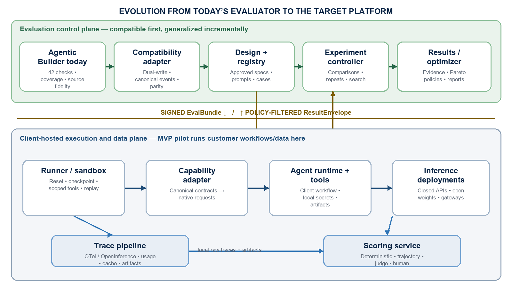

# Agentic Evaluator 实现计划

> 本文为 `agentic_evaluator_implementation_plan.docx` 的中文译本。Schema 名称、产品名和标识符保持英文，便于与实现对照。

从今天的 Agentic Builder 评测系统，走向一个与模型和供应商无关的平台：优化质量、工作流效率、缓存、延迟，以及每个成功任务的成本

| 文档类型 | 技术实现计划 |
| --- | --- |
| 建议基线 | 自有控制面 + 原生直连测量路径；在可替换合约之后对 runner 与 gateway 进行资格认定 |
| 优化顺序 | 保持当前行为 → 证据规范化 → 扩展评测 → 模型/工作流搜索 → 供应商优化 → 持续路由 |
| 编制日期 | 2026 年 9 月 3 日 |

**设计意图**

这是对 Agentic Builder 现有评测系统的扩展，不是从零替换，也不是一个新的 agent 框架。现有检查与报告语义在迁移过程中保持可用，底层证据则逐步规范化，以覆盖更广泛的工作流、模型、供应商和客户环境。

# 执行摘要

| 起点与方向 |
| --- |
| Agentic Builder 已经拥有一套可用的、本地执行的评测实践：确定性文件检查、严重性分级、检查执行覆盖率、源保真对比，以及早期的工作流结果度量。目标是在保留这套可信行为的同时，将其证据转化为可复用的评测器，从而能够可复现地比较异构 agent 工作流、模型、供应商以及客户侧托管运行。 |

| 当前已可用 | 尚不充分之处 | 目标状态 |
| --- | --- | --- |
| 42 项确定性文件检查，结果分为阻断（blocking）、建议（advisory）与仅观察（observe-only）；现有 Agentic Builder 报告会暴露检查是否实际运行。 | 证据与 schema 绑定在单一工作流和本地报告形态上；跨项目聚合、受控比较研究，以及规划/轨迹可见性仍不完整。 | 一套规范证据模型，在无语义损失的前提下导入当前结果，并支持多种任务族。 |
| 源保真行级对比，以及稳定的失败概念。 | 业务结果关联、非确定性可接受包络、经校准的评判器、连续评分，以及密封 holdout 尚未系统化。 | 版本化的 EvalDesignSpec、混合 scorer 图、校准、不确定性，以及可追溯的结果证据。 |
| 本地优先的数据处理，以及工作流特定的运维知识。 | 没有可复用的客户侧执行面、签名研究包、字段级发布策略，或可重复性胶囊。 | 安全的外部客户评测，数据和凭证默认留在客户本地。 |
| 初步的首次构建、编辑与有用性概念。 | 部分度量是一次性的、仅部分可观察，或尚不能跨项目比较；工作流规划与 checkpoint 恢复未端到端测量。 | 对完成、步骤、计划、缓存、成本、延迟、切换与恢复进行成对、重复研究。 |

| 建议 |
| --- |
| 自主掌控兼容边界、评测合约、优化器，以及可移植的 trace 格式。将 [Inspect AI](https://inspect.aisi.org.uk/) 作为首选的初始 runner 候选——而不是硬依赖——并对照精简自定义 runner 与托管平台进行资格认定。以原生直连供应商适配器作为测量基线。将 [Bifrost](https://docs.getbifrost.ai/overview) 作为领先的开源生产网关候选，将 [Portkey](https://portkey.ai/docs/product/ai-gateway) 作为偏治理的竞争方案，并再选一家托管挑战者。在其集成覆盖有价值时，将 [LiteLLM](https://docs.litellm.ai/) 用作广度/参考适配器——而不是默认网关或事实来源。 |

系统应在四个彼此独立的层上优化。把它们分开，是最重要的设计决策，因为每一层改变的是不同的因果变量：

1. **测量有效性。** 在比较模型之前，先定义有代表性的任务、确定性环境、可信的 scorer，以及 trace schema。

2. **模型与工作流组合。** 按角色选择模型——router、planner、executor、verifier、synthesizer 与 memory compressor——并使用规范部署与稳定的工作流设置。

3. **工作流性能调优。** 在不改变所选模型族的前提下（除非实验明确测试交互），优化提示结构、工具暴露、上下文管理、缓存、并发、重试、提前退出与升级。

4. **供应商与服务优化。** 仅在质量等价配置建立之后，再比较推理供应商或自托管引擎；然后按落地成本、延迟 SLO、缓存经济性、可靠性与运维约束进行选择。

第五个持续阶段把离线结果转化为受保护的路由策略，包含影子流量、金丝雀、回归门、漂移检测，以及滚动再评测。

## 本计划在现有评测器上新增的内容

- 不要把单一加权分数作为主要选择器。采用词典序门控：先正确性与安全，再任何延迟约束，然后在通过门控的候选中对成本与效率做 Pareto 优化。

- 不要孤立地奖励更少的步骤。一条短但不安全或未经核验的轨迹，差于一条稍长但成功的轨迹。将步骤分类为必要、有效、冗余、恢复、无效，或安全/核验。

- 将缓存行为视为实验条件。分别报告冷缓存与现实暖缓存臂，并隔离缓存命名空间，避免重复基准运行制造虚假优势。

- 将跨步骤模型切换作为一等实验因子，而不是默认改进。仅当异构工作流在计入交接延迟、重复上下文、缓存断裂与新失败模式之后，仍优于同模型对照时，才接受它。

- 将生成媒体作为一等产物，而不是强行塞进文本响应抽象。视频评测需要异步任务遥测、可复现的媒体清单、专门的时序 scorer，以及经人类校准的偏好判断。

- 对外部客户，将评测控制面与客户侧执行/数据面分离。向内发送签名的声明式评测包，向外仅发布经策略过滤的结果；客户凭证与原始敏感 trace 默认留在客户环境。

- 用人类标签验证 LLM 评判器，遮蔽模型/供应商身份，随机化成对顺序，并在可能时使用确定性结果检查。

- 在成对质量等价测试通过之前，将由两家供应商提供的同一模型视为两次部署；量化、tokenizer 版本、采样默认值、工具调用规范化与安全层都可能改变结果。

- 将逻辑角色路由与物理供应商路由保持为两个独立平面。评测器决定工作流步骤需要哪个模型；网关决定已选模型在何处被服务。两项决策都必须可独立固定并被 trace。

- 将目标工作流经济性与评测面开销分开。分别报告仅目标的成本/时间，以及含评分器、媒体分析、存储与人工审核的全量研究成本/时间。

- 从现有 Agentic Builder 评测实践出发，而不是从空白开始：确定性文件检查、显式的“从未执行”与“不可观察”状态、源保真对比、受控的新旧对比研究，以及允许清单的本地优先遥测，成为基线要求。

- 提供 AI 辅助设计工作室，从自然语言起草任务、行为、失败模式、数据集、scorer、评判提示与工作流提示规范。草稿在授权人类批准、并通过校准、泄漏与 holdout 隔离检查之前，绝不能成为选择证据。

## 目标运行结果

对每个任务族与运行模式，评测器应发出版本化的部署策略，例如：“规划用模型 A，执行用模型 B，仅当不确定性超过 τ 时才调用模型 C 做核验，延迟敏感模式经供应商 P 服务，经济模式经供应商 Q 服务，缓存策略为 K，重试策略为 R。”该决策必须有 trace 级证据、置信区间，以及可复现的 run manifest 作为支撑。

# 1. 我们现在在哪里，以及将去向何处

## 今天：已经有一套有用的评测器

EVAL.md 描述了一套正在 Agentic Builder 中实际使用的评测系统。对本计划而言，它应被视为运营基线与兼容合约——而不仅仅是背景材料。其最强的设计选择成为不变量；不完整或工作流特定的部分，成为第一批迁移待办。

| 当前能力 | 当前状态 | 迁移含义 |
| --- | --- | --- |
| 确定性产物检查 | 已实现 42 项基于文件的检查，覆盖阻断、建议与仅观察三级严重性。 | 通过兼容适配器导入；在证明对等之前不要重写。 |
| 执行覆盖 | 现有报告会区分检查是否实际执行，而不是把“无发现”等同于通过。 | 保留并推广状态模型：finding、no finding、skipped、never invoked、not observable，以及 evaluator error。 |
| 源保真 | 当前 Agentic Builder 路径已完成行级对比。 | 保留其输出，并为其他任务族增加结构化的声明/需求血缘。 |
| 跨项目证据 | 存在按项目报告，但可信的触发率聚合与显式的缺失项目覆盖尚未完成。 | 增加幂等的允许清单聚合，并在排名之前暴露缺失上传。 |
| 结果有用性 | 已识别首次构建时间、生成后编辑，以及新旧有用性，但部分是一次性的、半可观察的，或尚未受控/重复。 | 将它们变为固定的成对研究，具有可比较定义、完整仪器化与不确定性。 |
| 工作流轨迹 | 最终产物可见；规划、冗余工作、缓存行为、模型交接与恢复大多是盲区。 | 增加规范 trace 事件与 checkpoint 证据，且不要求隐藏推理。 |
| 部署范围 | 运行与原始证据局限于现有工作流本地。 | 增加客户侧执行/数据面，仅导出签名的、经策略过滤的结果。 |

## 保持不变的内容

- 现有 Agentic Builder 命令、检查、严重性含义与本地报告在迁移期间继续受支持。

- 只要结果可直接观察，确定性证据始终优先于模型判断。

- 先报告执行覆盖，再报告通过率；缺失或不可观察的证据，绝不能被静默计为成功。

- 原始敏感数据默认留在本地，任何聚合都使用显式允许清单与伪匿名标识符。

- 评测结论保持可审查：每一个分数都映射到输入、评测器版本、执行状态与证据产物。

## 将要改变的内容

| 变更层 | 从今天 | 到目标状态 | 成功过渡的证据 |
| --- | --- | --- | --- |
| 兼容性与证据 | Agentic Builder 特定的结果与报告文件 | 规范事件、manifest、分数状态与产物引用 | 黄金夹具产生相同的发现与严重性；新旧报告可对账。 |
| 任务定义 | 嵌入单一工作流的规则 | 带目标行为、用例、失败与 holdout 的版本化任务族 EvalDesignSpec | 可以在不改证据合约的前提下增加新任务族。 |
| 评分 | 主要是确定性文件检查与粗粒度结果度量 | 确定性、参考、DAG/可追溯性、经校准评判、成对人工，以及下游 scorer | 按评测器报告假通过/错误阈值与不确定性。 |
| 执行可见性 | 最终产物与部分运维遥测 | 可移植的轨迹、计划、缓存、交接、checkpoint 与成本/延迟 traces | 一个 episode 可以在不重跑推理的情况下回放、重评分并归属。 |
| 优化 | 观察单一工作流 | 跨模型角色、工作流控制，以及后续供应商部署的成对搜索 | 通过的候选构成 Pareto 集；晋升优于同模型/当前工作流对照。 |
| 客户使用 | 内部/本地工作流 | 向客户环境送入签名包，向外送出过滤后的结果信封 | 外部客户 MVP 在不导出原始敏感 traces 的情况下运行已批准的工作流/数据。 |

| 北极星 |
| --- |
| 团队应能保留今天可信的 Agentic Builder 结论，通过合约而不是定制评测代码来增加新的内部或外部工作流，并从可复现证据中选择模型/工作流/供应商策略——同时不把客户数据或凭证移出已批准环境。 |

# 2. 目标范围：从当前的 Agentic Builder 检查，走向通用评测器

| 相对今天的变化 |
| --- |
| 今天：评测器围绕单一 Agentic Builder 工作流及其产物组织。变化：将被评测对象推广为任务族、工作流、逻辑模型、物理部署、episode 与策略，同时把 Agentic Builder 作为第一个适配器。证明：Agentic Builder 对等通过，且第二个任务族使用相同合约，无需 Agentic Builder 特定的 schema 变更。 |

## 术语与缩写

| 术语 | 在本文中的含义 |
| --- | --- |
| AI | 人工智能。 |
| API / HTTP / CLI | 应用程序编程接口 / 超文本传输协议 / 命令行接口。 |
| ASHA / HPO | Asynchronous Successive Halving Algorithm / 超参数优化。 |
| CI | 持续集成：在代码或配置变更时自动运行的检查。 |
| DAG | 有向无环图；此处用于依赖与因果路径评测。 |
| E2E / p50 / p95 / p99 / LCB | 端到端 / 第 50、95、99 百分位 / 置信下界。 |
| GPU / KV cache | 图形处理器 / 用于复用模型注意力状态的键值缓存。 |
| JSON / YAML / SQL | 结构化数据与查询格式：JavaScript Object Notation、YAML 数据序列化，以及 Structured Query Language。 |
| LLM / ML / RAG / VQA | 大语言模型 / 机器学习 / 检索增强生成 / 视觉问答。 |
| MCP | Model Context Protocol，用于将模型或 agent 连接到工具与上下文源。 |
| MVP | 最小可行产品。 |
| OTel / OTLP | [OpenTelemetry](https://opentelemetry.io/docs/specs/semconv/) / [OpenTelemetry](https://opentelemetry.io/docs/specs/semconv/) Protocol，用于可移植的 traces、指标与日志。 |
| P0 | 初始发布所需的最高优先级功能或要求。 |
| PRD | 产品需求文档。 |
| [QAG](https://deepeval.com/docs/metrics-introduction) | 问答生成；用于测试来源支持或需求覆盖的原子问题。 |
| RBAC / ABAC | 基于角色的访问控制 / 基于属性的访问控制。 |
| 安全基础设施 | KMS = 密钥管理服务；VPC = 虚拟私有云；OIDC = OpenID Connect；mTLS = 双向传输层安全；SBOM = 软件物料清单；SSRF = 服务端请求伪造。 |
| SLO / SLA | 服务级别目标 / 服务级别协议。 |
| SME | 领域专家。 |
| 供应链治理 | OCI = Open Container Initiative；[NIST SSDF](https://csrc.nist.gov/pubs/sp/800/218/final) = 美国国家标准与技术研究院安全软件开发框架；SLSA = Supply-chain Levels for Software Artifacts；[OPA](https://www.openpolicyagent.org/docs) = Open Policy Agent。 |
| TTFT / TTL | 首 token 时间 / 存活时间。 |
| UX / UI | 用户体验 / 用户界面。 |

## 正在优化的对象

| 对象 | 含义 | 示例 |
| --- | --- | --- |
| 任务族 | 具有共享工具、风险与延迟需求的工作总体。 | 编码、浏览器操作、研究、数据分析、文档生产、支持运营 |
| 工作流 | 角色、提示、工具、预算、状态与控制策略的版本化图。 | 单 agent 循环；planner/executor；router + 专家；按需 verifier |
| 模型引用 | 独立于服务位置的逻辑模型身份与能力画像。 | 闭源 API 模型快照；开源权重 checkpoint + tokenizer 修订 |
| 部署引用 | 通过供应商、区域、层级或自托管引擎服务的模型。 | 供应商 API；Bedrock/Vertex 托管模型；[vLLM](https://docs.vllm.ai/en/latest/examples/features/automatic_prefix_caching/) 部署 |
| Episode | 在一个冻结配置下，完成一个任务的一次隔离尝试。 | 任务种子 + 环境快照 + 工作流 + 部署映射 |
| 策略 | 从任务与运行模式到工作流/部署的选定映射。 | 延迟模式、经济模式、高保障模式 |

## 不可妥协的原则

- 通过能力协商实现模型无关，而不是最小公约数 API。原生推理、结构化输出、多模态、工具流式传输与缓存控制必须被显式表示，缺失时标记为不支持。

- 通过分开的 model_ref 与 deployment_ref 标识符实现供应商中立。每一项指标与 trace span 都同时携带两者。

- 通过不可变的 run manifest 实现可复现性：数据集版本、环境镜像、工作流修订、提示哈希、工具版本、采样设置、供应商元数据、时间戳，以及评测器版本。

- 结果优先评分。在语义评分器之前，使用可执行断言、环境状态、数据库变更、测试或产物检查。

- 成对比较。在相同的任务/种子块上运行候选，并分析成对增量，以降低任务难度带来的噪声。

- 安全与最小权限。沙箱、作用域凭证、trace 脱敏、缓存隔离与出口策略是评测的一部分——而不是事后运维补丁。

- 不做仅基准优化。公开套件是适配器与诊断；发布门是版本化的、私有的、有代表性的任务集。

# 3. 决策策略：从通过计数，走向结果、风险与经济性

| 相对今天的变化 |
| --- |
| 今天：当前检查能识别重要的产物失败与早期结果度量，但尚不能在众多模型/工作流/供应商组合中做选择。变化：将正确性、安全、可靠性以及任何截止时间要求作为门控；在多维 Pareto 前沿上比较剩余候选。证明：没有任何更便宜或更快的候选，可以通过隐藏质量失败、缺失检查或评测面成本而被晋升。 |

| 首要规则 |
| --- |
| 仅在满足最低质量、安全与可靠性要求的候选中，选择最便宜、最快的配置。保留 Pareto 前沿，而不是把所有目标折叠成脆弱的标量分数。 |

## 约束层级

1. 硬有效性门：环境完整性、工具权限、策略合规，以及不存在取消资格的安全失败。

2. 质量门：任务成功与关键子分数以所需统计置信度超过阈值。

3. 可靠性门：失败、超时、畸形工具调用与重试耗尽率保持在限制内。

4. 适用时的延迟门：端到端 p95 或截止成功满足任务特定 SLO。

5. Pareto 选择：在最大化缓存收益与稳健性的同时，最小化每个成功任务的落地成本、端到端时间、冗余工作与运维负担。

## 核心派生度量

| 度量 | 定义 | 为何重要 |
| --- | --- | --- |
| 成功率 | 通过的 episode ÷ 有效 episode；报告 pass@1 以及重复尝试上的可靠性。 | 主要结果；按任务族与风险层级分段。 |
| 每个成功任务的成本 | 报告仅目标与全量两种变体。两者都计入失败尝试与重试；全量还包含 scorer/评判器、媒体分析、标注、trace 存储与分析。 | 避免“每次调用便宜、每个结果昂贵”，同时保留公平的仅供应商视角。 |
| 评测面开销 | 评判/scorer 推理、媒体处理、标注、trace 传输/存储与分析的成本/时间，与目标工作流分开报告。 | 防止一个廉价目标仅因昂贵评测工作被隐藏而显得高效。 |
| 截止成功 | 既通过又在 SLO 前完成的有效 episode 比例。 | 对交互式任务同时结合延迟与有用性。 |
| 步骤效率 | （必要 + 有效动作）÷ 全部动作，并对无效与冗余动作分别施加惩罚。 | 不惩罚必要的核验或安全恢复。 |
| 计划效率 | 关键路径膨胀、计划抖动、依赖违反，以及规划 token 占比。 | 衡量规划是否减少了工作，而不仅仅是增加了文字。 |
| 进展保留与恢复 | 对具有已核验里程碑的任务：到达第一个可行状态的时间、里程碑执行有效性、最佳已确认状态保留、回退深度，以及已确认恢复。 | 解释一次长运行是在前进、退化并修复——而不仅仅是最终状态是否通过。 |
| 有效缓存收益 | （无缓存等价成本 − 实际缓存成本 − 存储/写入成本）÷ 无缓存等价成本。 | 可在计费方式不同的供应商之间比较。 |
| 切换开销 | 因更换模型导致的增量序列化、重复输入、缓存未命中、请求、TTFT/排队时间与交接失败。 | 确保多模型工作流在端到端上获胜，而不仅仅是每次调用价格更低。 |
| 落地成本 | 模型、缓存、工具、存储、出口、编排，以及自托管摊销成本。 | 提供诚实的供应商比较。 |

## 避免过早标量化

加权分数可以作为用户可配置视图提供，但不应成为事实来源。存储原始指标与置信区间，保留非支配候选，并使用运行模式策略选择部署：

- 延迟模式：强制截止成功与 p95 延迟门，然后最小化成本。

- 经济模式：强制质量/可靠性门，然后最小化每个成功任务的成本。

- 高保障模式：提高质量与安全阈值，允许 verifier/升级步骤，然后在这些门控下最小化成本。

# 4. 任务与评分设计：从嵌入式检查，走向版本化规范

| 相对今天的变化 |
| --- |
| 今天：Agentic Builder 检查与源保真逻辑，以工作流特定形式编码了有价值的任务知识。变化：先包装这些检查，再通过版本化的目标行为、测试用例、失败模式、scorer 图、校准集与 holdout 来表达新任务族。证明：原始检查保持相同结论，同时可以在不使用任意绝对分数的情况下评测非确定性与业务落地工作流。 |

## 使用组合，而不是单一基准

构建私有的代表性套件，并用开放基准适配器加以补充。[Inspect AI](https://inspect.aisi.org.uk/) 是强有力的开源 harness 候选，因为它支持数据集、agent、自定义与 MCP 工具、scorer、第三方 agent，以及多种沙箱后端。公开套件可以贡献任务形态：[SWE-bench](https://github.com/swe-bench) 用于仓库问题修复，[BrowserGym](https://github.com/ServiceNow/BrowserGym) 用于 Web 环境，[GAIA](https://openreview.net/pdf?id=fibxvahvs3) 用于需要推理、多模态、浏览与工具使用的通用助手，以及 [τ-bench](https://taubench.com/) 用于带状态评分的工具-agent-用户交互。

| 任务族 | 代表性结果 | 首选评分 |
| --- | --- | --- |
| 软件工程 | 补丁通过测试、尊重范围，且不回退受保护行为。 | 可执行测试 + diff 策略 + 静态检查 |
| 浏览器 / SaaS 操作 | 正确的记录、字段、接收方与状态转换；无未授权动作。 | 环境状态断言 + 动作策略 |
| 研究 / 综合 | 声明有支持、当前、完整，并被恰当限定。 | 引用验证 + 事实检查 + 量规 |
| 数据分析 | 正确的转换、公式、图表与结论。 | 单元格/数值断言 + 不变量检查 |
| 文档 / 产物生产 | 满足内容要求与视觉/布局标准。 | 结构检查 + 渲染检查 + 量规 |
| 客户 / 支持运营 | 跨轮次的策略合规解决与正确后端动作。 | 数据库终态 + 策略检查 + 对话量规 |
| 长上下文 / 记忆 | 保留所需事实、丢弃噪声，并安全使用历史。 | 探针/不变量检查 + 矛盾测试 |
| 安全 / 对抗 | 抵抗提示注入、数据泄漏、权限提升与不安全工具使用。 | 攻击特定断言 + 沙箱/出口审计 |

## 数据集构建

- 按难度、视界长度、工具数量、歧义、上下文规模、风险与延迟敏感性分层。仅在产品分数中按预期生产频率加权；保留未加权的诊断切片。

- 创建小型开发集、版本化验证集，以及隔离的 holdout。轮换部分 holdout，以限制评测器过拟合。

- 增加扰动变体：改写、重排的无关上下文、良性工具失败、慢工具、过期数据、冲突指令，以及部分状态。

- 记录任务出处、许可/数据权利、期望状态、禁止动作、超时、成本预算、延迟等级、scorer 版本，以及已知非确定性。

- 在任务族成为选择证据之前，在冻结环境中验证：SME 执行工作流，独立审阅者检查指令闭合/歧义/可解性，试点 agent traces 识别隐藏依赖、环境缺陷或脆弱指令。将由此产生的修复与拒绝原因版本化。

| 继承的平台要求 |
| --- |
| 测量完整性本身就是被评测的结果。推广 EVAL.md 的执行覆盖纪律，使每一份报告在通过率或排名之前，先展示 scorer 覆盖、缺失遥测、未激活项目或 agent、评测器错误，以及不可观察字段。 |

## 规范非确定性任务与可接受行为

非确定性工作流不应由一个期望字符串或一条理想轨迹来定义。定义可接受包络：必需不变量、允许变化、禁止行为、可观察结果证据、已知不确定性，以及分布性测试计划。下面的规范 EvalDesignSpec 在模型比较之前编写，并按研究冻结。

```yaml
eval_design_spec:
  task: {type, user_or_business_goal, context, risk_class, latency_class}
  target_behavior:
    required_outcomes: []
    acceptable_variation: []
    prohibited_actions_or_claims: []
    invariants: []
    abstain_or_escalate_when: []
  test_cases:
    - {id, provenance, input_ref, preconditions, expected_evidence,
       perturbations, difficulty, slice, hidden_answer_ref}
  failure_modes:
    - {id, severity, trigger, observable_signature, detector_ref,
       recovery_expectation, business_consequence}
  scoring:
    deterministic_gates: []
    reference_questions: []
    dependency_graph_ref: null
    subjective_dimensions: []
    judge_prompt_ref: null
    human_calibration_ref: null
    aggregation_policy: lexicographic_then_pareto
  sampling: {attempts, seeds, cache_arm, timeout, stopping_rule}
  partitions: {development, calibration, validation, sealed_holdout}
  versions: {task, workflow, prompt, dataset, scorer, judge, environment}
```

- 在用户或业务可观察的层次上指定结果；仅当中间行为对安全、诊断或经验证的因果路径必要时，才指定它们。

- 在测试数据之前创建失败模式。每一个实质性失败都获得严重性、检测方法、期望恢复或弃权响应，以及业务后果；用该目录生成正常、边界、对抗与恢复用例。

- 对分布评分，而不是对展示性运行评分。在重复成对尝试上报告 pass@1、可接受输出率、置信区间、尾部延迟、弃权质量，以及按严重性加权的失败发生率。Best-of-N 可以是单独的生产策略，但绝不能伪装成首次尝试可靠性。

- 在精确输出会变化时，对事实使用原子参考问题与不变量检查；对条件需求使用 DAG；对剩余质量使用经校准的比较判断；对高影响歧义使用人工裁定。

## Scorer 栈与优先级

1. 确定性验证器：精确值、单元/集成测试、schema、SQL/环境状态、文件哈希、产物结构、权限违反。

2. 感知参考的指标：必需事实、覆盖、引用、补丁语义、任务特定约束，以及当存在权威来源语料时，采用 [QAG](https://deepeval.com/docs/metrics-introduction) 风格的问答检查。

3. 条件与轨迹评测器：工具选择、参数、顺序约束、循环/重试行为、破坏性动作策略，以及步骤分类。当需求具有已知分支或早失败条件时，使用 [DAGMetric](https://deepeval.com/docs/metrics-dag) 风格的图；即使个别评判节点仍是概率性的，终端分数映射也因此受控。

4. [G-Eval](https://aclanthology.org/2023.emnlp-main.153/) 风格评判：留给剩余的、本质上主观的品质，如清晰度、设计质量、品牌契合或比较偏好。冻结量规/评测步骤，遮蔽身份，随机化顺序，并在需要视觉证据时使用有能力的多模态评判器。

5. 人工审核：校准 scorer 选择与阈值，然后审计分层抽样的胜利、失败、平局、安全失败，以及令人惊讶的供应商差异。

6. 词典序决策策略：仅在各分量被测量之后再组合。强制性完整性、安全、任务成功、可靠性与延迟门，不能被高主观分数抵消。

## 按任务与输出属性选择评测器

| 选择规则 |
| --- |
| 词典序门是决策策略，而不是 scorer。为每个属性选择最强可用证据：对事实状态与安全使用确定性证据，对事实声明使用来源落地证据，对条件需求使用显式决策图，对剩余主观性使用经校准的 LLM/人工判断。 |

| 任务或属性 | 主要 scorer 组成 | 如何进入决策 |
| --- | --- | --- |
| 代码、数据、浏览器与事务操作 | 可执行测试；状态/数据库断言；schema；权限与副作用审计。为工具与参数增加轨迹检查。 | 硬门。不要用 [G-Eval](https://aclanthology.org/2023.emnlp-main.153/) 替代可验证结果。 |
| 落地研究、RAG、摘要与事实文档 | 引用/来源验证；声明级检查；用于覆盖/忠实度的 [QAG](https://deepeval.com/docs/metrics-introduction)；对争议声明进行定向人工裁定。 | 事实性/覆盖的质量门；仅在落地通过后，[G-Eval](https://aclanthology.org/2023.emnlp-main.153/) 才可评估综合或有用性。 |
| 策略、安全与条件合规 | 尽可能使用确定性规则；对已知例外路径使用 [DAGMetric](https://deepeval.com/docs/metrics-dag) 风格分支；对歧义使用红队用例与人工审核。 | 硬门或近硬门。高整体评判分数不能补偿违规。 |
| 长视界工具工作流 | 环境状态断言；轨迹/计划分类；checkpoint 与恢复测试；对条件转换使用 [DAGMetric](https://deepeval.com/docs/metrics-dag) 风格规则。 | 成功/可靠性门，外加步骤与计划效率诊断。 |
| 主观文本、视觉设计、UX 或创意产物 | 带冻结量规的 [G-Eval](https://aclanthology.org/2023.emnlp-main.153/)，最好是盲法成对比较；多个评判模型或人工评分者用于校准。 | 硬要求通过后的软质量目标；保留不确定性与切片级一致性。 |
| 视频完整性、提示事实、身份与时序连贯 | 产物检查；时序/视觉指标；原子 VQA 断言；跟踪与时间编码证据；对困难案例进行人工审计。 | 硬门或最低质量门。审美偏好绝不能为畸形、不安全或偏离提示的视频开脱。 |
| 视频审美、品牌与创意质量 | 使用帧/片段与时间编码证据的多模态 [G-Eval](https://aclanthology.org/2023.emnlp-main.153/) 风格成对量规；用于校准的人类偏好标签；自动化审美模型仅用于分诊。 | 在已通过完整性、提示、角色、时序与延迟门的片段中作为 Pareto 目标。 |

## 评测器验证

在将任何评判器用作优化目标之前，测量其与人类标签的一致性、假通过与假失败率、成对位置偏差、冗长偏差、自我偏好，以及跨评判模型的稳定性。在实验期间冻结评测器版本。当评测器变更时，尽可能对已存储 traces 重新评分，并创建新的基准版本，而不是覆盖历史。

## AI 辅助评测与工作流设计工作室

第一遍编写体验应是对话式的：用户描述任务类型、业务或用户目标、上下文、示例、已知失败、风险、数据约束，以及期望运行模式。助手把这些材料转换为可审查的版本化草稿，而不是要求用户手写 YAML、评分代码、评判提示与数据集清单。

| Copilot 模块 | AI 辅助工作 | 晋升护栏 |
| --- | --- | --- |
| 任务与行为设计器 | 引出缺失上下文；起草目标结果、可接受变化、不变量、禁止行为、升级规则与任务切片。 | SME 批准语义正确性与业务相关性；未解决假设保持显式。 |
| 失败模式设计器 | 从工作流阶段、风险等级、先前 traces、支持工单与扰动库提出失败；将每一项映射到检测器与后果。 | 安全/领域负责人确认严重性与覆盖；生成列表不能静默重定义策略。 |
| 数据集工作室 | 将已批准种子用例变为边界、改写、噪声、冲突、延迟、工具失败与对抗变体；提出覆盖平衡与去重。 | 记录合成出处；扫描泄漏/重复；SME 验证可解性；密封 holdout 对生成与调优不可访问。 |
| 评判提示工作台 | 起草原子问题、证据要求、弃权行为、反例、成对形式与结构化输出；从校准错误诊断分歧。 | 仅针对人类标注校准数据优化；冻结已晋升版本；评估假通过/失败与偏差；变更后对已存储输出重评分。 |
| 评分方法工作台 | 从失败目录建议确定性检查、参考测试、依赖图、阈值、不确定性分析，以及不可补偿门。 | 保留原始度量；禁止发明的聚合分数覆盖关键门；阈值/决策策略变更需要批准。 |
| 工作流提示工作室 | 从 trace 证据起草并迭代任务类型、目标、上下文、工具指令、输出合约、升级、记忆与交接提示。 | 在开发数据上调优，在验证上选择，在 holdout 上确认一次；用成对消融与固定模型/供应商对照比较变更。 |

助手应将每一项提议变更解释为绑定到观察证据的假设：它针对哪个失败、哪个切片应当改善、可能发生什么回归，以及实验将如何判定。它可以打开草稿变更集、生成测试并启动已批准实验；它不得将自己的提案标为成功、暴露 holdout 答案，或在没有声明批准门的情况下晋升评判器、数据集、评分规则或工作流提示。

1. 起草：生成带显式未知与出处的 EvalDesignSpec、WorkflowSpec、种子用例、评判提示与评分图。

2. 批评：运行 schema 检查、覆盖分析、歧义/可解性审查、重复/泄漏扫描、scorer 单元测试，以及对抗审查。

3. 校准：将评判/scorer 输出与人类标签比较；仅在校准分区上调优，并报告假通过、假失败、弃权与子组错误。

4. 实验：在成对验证用例上对照冻结基线评估变更；将生成与 traces 独立于分数存储，以便评测器变更可以在不重新生成的情况下重评分。

5. 批准与发布：要求授权负责人接受 diff，然后对晋升产物签名并版本化。在密封 holdout 上确认，并在下一轮迭代前监控生产漂移。

## 长视界过程、经验与 harness 评测

对具有可验证中间状态的工作流，最终结果仍是决定性的，但应补充任务激活的诊断。这结合了 [Workflow-GYM](https://arxiv.org/html/2606.11042) 中的现实任务验证纪律、[Beyond Final Scores](https://arxiv.org/html/2608.13417) 中的过程循环度量，以及 [Agent Evaluation: A Detailed Guide](https://cameronrwolfe.substack.com/p/agent-evals) 中的模型加脚手架视角。这些是诊断模块——不是通用标量分数，也不是奖励忙碌工作的理由。

| 模块 | 协议与信号 | 决策用途 |
| --- | --- | --- |
| 过程循环：框架、执行、反馈控制 | 定义已核验里程碑与阶段依赖图。测量到达第一个可行或最佳已确认路径的时间/迭代；有效里程碑执行与阶段遗漏；然后是最佳已核验状态的保留、回退深度/率，以及失败后的已确认恢复。 | 诊断目标漂移、错误传播与脆弱恢复。仅在中间状态可核验处启用；保留最终成功、安全与截止门。 |
| 经验复用反事实 | 任务内：从固定状态分支，并在保留产物、runner 与环境的同时，将累积上下文/笔记/记忆与干净上下文臂比较。跨任务：将有界、相关的经验包与无先前经验比较；防止原始答案或产物泄漏。记录增益与负迁移。 | 仅当记忆或经验在不成对结果、延迟、安全或污染风险不可接受的情况下改善成对结果时，才晋升它们。 |
| Harness 与上下文敏感性 | 将工具 schema/描述、上下文检索与压缩、稳定前缀策略、checkpoint 策略与 agent 脚手架视为版本化因子。固定模型与任务；运行定向消融与成对比较。将规范 harness 结果与原生 agent 结果分开。 | 将可部署单元报告为模型 + 工作流/脚手架 + 供应商，并把增益归属到相关层，而不是宣布通用“最佳模型”。 |
| 任务现实性与闭合 | 在准入前要求冻结环境中的 SME 执行、独立指令审查，以及试点 agent 轨迹审查。保留期望结果、允许动作、环境镜像、依赖图与任务变更日志。 | 拒绝或隔离歧义、不可解、泄漏或环境损坏的用例；防止优化器学习基准产物。 |

# 5. 架构：从本地报告，走向可移植控制面

| 相对今天的变化 |
| --- |
| 今天：Agentic Builder 评测在本地运行，并产生工作流特定报告。变化：插入兼容适配器以 dual-write 规范证据，然后在其周围增加已批准的规范、实验、优化与客户执行层。证明：当前 Agentic Builder 输出在影子运行期间精确对账，而相同的规范合约支持第二个 runner 与外部客户试点。 |

架构围绕——而不是远离——当前评测器演进。兼容适配器首先将现有 Agentic Builder 检查、覆盖、保真与结果记录翻译为规范事件。随后，通用控制面将任务/评测设计与 agent 运行时及推理部署分离。AI 辅助设计工作室帮助用户起草评测与工作流规范，但只有已批准、版本化的产物进入场景注册表。[OpenTelemetry](https://opentelemetry.io/docs/specs/semconv/) 语义约定为 spans、指标、日志与事件提供可移植基础；[OpenInference](https://github.com/Arize-ai/openinference) 增加 AI 特定的 trace 结构。[Phoenix](https://arize.com/docs/phoenix/) 接受 OTLP/[OpenInference](https://github.com/Arize-ai/openinference) traces，并支持数据集、实验与评测器，而 [Langfuse](https://langfuse.com/docs) 提供跨越 tracing、提示、数据集与评测的开放、可自托管替代方案。



*图 1. 今天的 Agentic Builder 评测器通过经过对等测试的兼容适配器进入。已批准的规范包随后可以在本地或客户侧执行/数据面中运行；原始工作流数据、凭证、产物与详细 traces 留在客户侧，仅返回允许清单中的结果信封。*

| 层 | 职责 | 模型/供应商中立机制 |
| --- | --- | --- |
| 0. 当前 Agentic Builder 基线 | 现有文件检查、严重性分级、执行覆盖、保真结果、本地报告，以及运营结果记录。 | 在对等签字之前，仍是事实来源。 |
| 1. 兼容适配器 | 将当前检查与报告映射为规范分数状态、证据引用、manifest 与事件；支持 dual-write。 | 翻译合约与黄金夹具对账隔离遗留细节。 |
| 2. AI 设计工作室 + 注册表 | 为任务、行为、失败、数据、scorer、评判/工作流提示、夹具与风险/延迟等级提供引导草稿与已批准版本。 | 仅产出规范产物；批准与 holdout 边界与供应商无关。 |
| 3. 实验控制器 | 扩展搜索空间、分块/随机化试验、调度重复，并对弱候选提前停止。 | 在逻辑 WorkflowSpec 与 DeploymentMap 记录上工作。 |
| 4. Runner / 沙箱 | 执行当前或新的 agent，管理状态、超时、作用域工具、故障注入与回放。 | Agentic Builder 桥接，外加命令行与 HTTP 适配器；容器化环境。 |
| 5. 能力适配器 | 将规范消息、工具、schema、媒体与控制编译为原生供应商请求。 | 能力清单 + 显式的不支持/降级标志。 |
| 6. Trace + 评分 | 捕获计划/模型/工具/状态/缓存/成本/重试事件，并运行确定性、轨迹、评判与人工分数。 | OTel/OTLP 信封；scorer 消费规范 EpisodeResult/Trace。 |
| 7. 结果 / 优化器 | 存储不可变 manifest 与原始结果；计算不确定性、Pareto 前沿与策略。 | 保留原始事实；仪表盘是可替换视图。 |

## 建议的规范标识符

```yaml
model_ref:
  family: <logical model family>
  version: <snapshot or checkpoint revision>
  tokenizer_revision: <revision or unknown>
  capabilities: [tools, json_schema, vision, reasoning_controls]

deployment_ref:
  provider: <provider or self-hosted>
  region: <region>
  service_tier: <tier>
  model_ref: <reference>
  serving: {engine, quantization, hardware, concurrency_profile}

workflow_binding:
  planner: {model_ref, deployment_ref}
  executor: {model_ref, deployment_ref}
  verifier: {model_ref, deployment_ref, invoke_when: uncertainty > tau}

episode_key:
  dataset_version + task_id + seed + workflow_revision + deployment_map
```

## 适配器合约

- 暴露规范内容块（文本、图像、音频、文件）、工具 schema、结构化输出约束、流式事件、推理/努力控制、可用时的 logprobs，以及缓存指令。

- 对异步媒体生成，暴露提交、轮询/webhook、取消与产物获取操作；将排队、生成、审核、后处理与传输时间保留为独立 spans。

- 返回规范化用量外加原始供应商元数据。绝不要丢弃审计、定价、缓存记账或质量等价分析所需的原生字段。

- 发布 CapabilityProfile，并在不支持的要求上快速失败。“模拟”与“降级”模式必须是可见的实验因子，而不是静默回退。

- 将原生直连适配器作为参考路径。网关——包括 [Bifrost](https://docs.getbifrost.ai/overview)、[Portkey](https://portkey.ai/docs/product/ai-gateway)、[LiteLLM](https://docs.litellm.ai/) 与托管服务——必须是可选部署适配器，其翻译、重试、路由、缓存行为与开销被显式测量。

## 分离两个路由平面

评测器拥有逻辑路由：任务族 → 工作流 → 角色或步骤 → ModelRef。网关仅在该选择之后拥有物理路由：ModelRef → 供应商、区域、层级或服务部署。在因果实验期间，任一平面都可以被固定，同时另一平面变化。分别 trace `route.logical_decision` 与 `route.deployment_decision`；绝不允许自适应网关别名静默改变工作流优化器所选的模型。

## Trace 事件最低要求

| 事件类型 | 必需字段 |
| --- | --- |
| episode.start/end | ID、任务/工作流版本、时间戳、结果、终止原因、环境哈希 |
| plan.create/update | 计划节点、依赖、理由可见性策略、修订、活动节点、完成状态 |
| model.request/response | model_ref、deployment_ref、设置、提示哈希、token 用量、TTFT、时长、完成/错误 |
| route.decision/handoff | 策略/规则、候选、所选绑定、原因、序列化状态哈希、上下文规模、验证结果、增加的成本/时间/缓存损失 |
| tool.call/result | 工具/版本、参数哈希或脱敏载荷、延迟、重试、结果哈希、副作用类别 |
| cache.read/write | 层、合格 token、命中 token、键命名空间、TTL、读/写/存储成本、未命中/中断原因 |
| state.checkpoint | Checkpoint ID/序列、工作流与状态 schema 修订、环境哈希、持久产物引用、待处理副作用、幂等/补偿键、恢复入口、完整性哈希、加密/保留等级 |
| score | 评测器/版本、执行状态（finding/no finding/skipped/never invoked/not observable）、输入、原始度量、置信度、理由/证据、成本、延迟 |

## 长视界 checkpoint 与恢复

| 要求 |
| --- |
| Checkpoint 是持久、可验证的恢复边界——而不是 transcript 转储。它必须捕获安全恢复所需的最小状态，外加足够出处，以证明该边界处存在哪些环境、工作流、权限与外部效果。 |

- 在确定性恢复点做 checkpoint：在外部可见副作用之前与之后、在已验证状态变更之后、在模型/供应商交接处、在长时间等待或异步任务之前、在时间/预算租约阈值处，以及在计划里程碑处。允许为昂贵不可逆工作设置任务特定 checkpoint；不要为每一个 token 或中间想法做 checkpoint。

- 持久化不可变 checkpoint manifest，包含 TaskSpec 与 WorkflowSpec 修订、episode/尝试 ID、规范 StepResult、环境快照或引用、持久文件/数据库/产物引用、活动计划节点、开放问题、待处理操作、幂等与补偿键、状态 schema 版本、完整性哈希，以及加密/保留等级。将大型载荷按内容寻址引用存储，而不是在 traces 中复制。

- 通过围栏租约恢复：验证 manifest 签名、schema 兼容性、环境哈希、凭证/权限与产物可用性；然后获取一个可恢复 worker 租约。对超时或歧义写入，先用幂等键查询外部系统再重试。如果状态无法被证明，则停止以进行补偿、修复或人工审核——绝不重放不确定的破坏性动作。

- 使 checkpoint 迁移显式且可逆。新的 runner 或工作流版本仅能通过经过测试的迁移读取较旧 checkpoint；否则将其保留为仅回放证据，并启动声明的新尝试。

- 测量 checkpoint 开销与恢复质量：存储/写入时间与成本、增加的延迟、恢复成功、平均恢复时间、已恢复成本/时间、重复副作用防护，以及相对不中断对照的通过/非劣效。报告结果是全新、已恢复、已修复还是已放弃。

# 6. 交付顺序：从今天的评测器，走向目标平台

| 相对今天的变化 |
| --- |
| 今天：当前评测已经有用，但其证据尚不是可移植的实验基底。变化：从对等与可观察性开始，然后增加辅助规范、受控模型/工作流搜索、工作流调优、供应商优化与持续验证。证明：每一阶段都以可测试产物退出，并且可以在不禁用现有 Agentic Builder 评测路径的情况下被采纳。 |

| 阶段 | 主要因果问题 | 退出产物 |
| --- | --- | --- |
| 0 —— 保持并规范化 | 当前 Agentic Builder 结论能否在证据被规范化、缺失可观察性被暴露的同时被精确复现？ | 黄金对等套件 + 兼容适配器 + 规范 trace/scorer 合约 |
| 0.5 —— 辅助评测设计 | 用户能否定义经校准与审查后仍成立的目标行为、用例、失败、评判器与评分？ | 已批准的 EvalDesignSpec、数据集、scorer 图与密封 holdout |
| 1 —— 模型/工作流搜索 | 在受控服务条件下，哪种模型角色拓扑产生最佳通过结果？ | 按任务族的逻辑工作流 Pareto 集 |
| 1.5 —— 工作流调优 | 所选工作流能否在不损失质量的前提下减少冗余工作、缓存更多，并满足 SLO？ | 调优后的工作流变体与缓存/控制策略 |
| 2 —— 供应商/服务优化 | 每个所选模型应在何处运行，以获得最佳落地经济性与延迟？ | 部署矩阵与运行模式路由策略 |
| 3 —— 持续验证 | 该策略在漂移、生产流量、失败与新发布下是否仍然有效？ | 回归门、影子/金丝雀流程、滚动基准 |

## Phase 0 —— 保持、包装，并建立测量对等

目标：使当前评测器成为可信基线，消除测量误差，并在花费组合实验之前，在不改变其结论的情况下增加可观察性。

- 盘点并冻结当前 EVAL.md 行为：42 个检查 ID、严重性含义、调用路径、文件/报告 schema、源保真输出，以及当前结果度量。捕获有代表性的通过、finding、never-invoked、不可观察与错误夹具。

- 构建 Agentic Builder 兼容适配器，并将当前输出 dual-write 到规范 Score、ArtifactRef 与 TraceEvent 记录。在切换前，对每一个黄金夹具对账计数、严重性、证据与执行状态。

- 增加带伪匿名项目 ID、允许清单字段、幂等上传、完整性记账与显式缺失项目/上传状态的安全跨项目聚合；保持原始本地报告为权威。

- 定义 EvalDesignSpec、TaskSpec、WorkflowSpec、ModelRef、DeploymentRef、CapabilityProfile、RunManifest、TraceEvent、Score 与 ArtifactRef schema。

- 在每个初始任务族中实现一个确定性任务，并证明干净重置、回放、超时与隔离行为。

- 仪器化端到端与 span 级计时：排队、模型 TTFT、模型生成、工具等待、编排、评判，以及总墙钟时间。

- 对至少一个闭源模型与一个开源权重部署对账用量与发票；验证 token 与缓存记账。

- 创建带已知通过、失败、部分、策略违反与歧义用例的 scorer 测试夹具。在优化前测量评判-人类一致性。

- 在适当时建立基线单模型 agent 与“空”或脚本化基线，以检测损坏/过易任务。

- 仅在冻结环境中的 SME 执行、独立指令闭合/可解性审查，以及试点 agent trace 审查之后，才准入初始任务族。捕获阶段依赖、环境前置条件与修复历史。

- 证明一条长视界 checkpoint/重启路径：在幂等副作用之前与之后故意中断一个 episode，验证正确状态恰好恢复一次，并记录恢复开销。

| 退出门 |
| --- |
| 所有当前黄金 Agentic Builder 夹具在旧报告与规范报告中产生语义相同的发现、严重性、证据与执行状态；缺失覆盖变得更可见，而不是更少。重复 episode 产生可解释方差，每一美元与每一毫秒都可归属，并且重置/凭证隔离通过安全测试。 |

## Phase 0.5 —— AI 辅助评测设计与校准

目标：使严谨的评测编写可及，同时不允许编写模型验证或晋升自己的工作。本阶段发生在广泛模型搜索之前；之后的变更创建新的评测器版本，并要求重评分/再确认，而不是静默移动目标。

- 对任务类型、业务/用户目标、运行上下文、来源证据、可接受变化、禁止行为、风险、延迟/成本约束与已知失败进行引导式采集；保留未回答问题，而不是用模型假设填补。

- 从已批准种子与失败目录起草正常、边界、扰动、对抗与恢复用例。跟踪真实与合成出处、重复、覆盖、可解性、数据权利，以及隐藏答案是否可能泄漏到目标工作流。

- 首先生成原子确定性/参考检查，然后是依赖逻辑，然后是评判提示与针对剩余歧义的人工指令。每一个评判输出必须引用证据、支持弃权，并使用结构化 schema。

- 在人类标注示例上校准评判器与 scorer 阈值；测量假通过、假失败、位置/冗长偏差、稳定性、子组错误，以及对良性改写的敏感性。仅在校准上修订，并在比较运行前密封 holdout。

- 将 PRD、PRD 到代码、实时转写，以及抽取/表单示例实例化为合约符合性夹具。在完整性矩阵中记录缺失的 schema 概念、未指定的客户输入，以及任务特定扩展。

| 退出门 |
| --- |
| 授权的任务/评测负责人批准 EvalDesignSpec、失败目录、scorer 图、评判/人工指令、数据集分区与发布画像；所有 scorer 都有执行覆盖测试；holdout 受访问控制，且对编写/调优 agent 不可用。 |

## Phase 1 —— 模型与工作流组合搜索

目标：在尽可能保持供应商/服务条件恒定的同时，选择逻辑模型-角色组合。

### 候选角色

- Router / 任务分类器：选择工作流、工具、预算与升级策略。

- Planner：分解工作并识别依赖或信息缺口。

- Executor / 工具选择器：执行动作并解释结果。

- Synthesizer：从已核验状态创建最终答案或产物。

- Verifier / critic：检查结果证据、策略与不确定性；可触发修复。

- Memory/context 管理器：压缩状态并选择历史或检索上下文。

### 何时跨步骤模型切换值得做

是的——当相邻角色在能力、成本、延迟、上下文或保障要求上有实质性差异，且收益超过交接惩罚时。它应保持为经验假设：短、紧耦合、延迟敏感的工作流可能因保留上下文与供应商缓存连续性，而在单一模型上表现更好。

| 模式 | 最佳适配 | 期望优势 | 主要切换成本 |
| --- | --- | --- | --- |
| 强 planner → 经济 executor | 长视界或依赖重、且有许多常规动作的任务。 | 分解只花一次钱；使重复执行更便宜。 | 状态序列化与 executor 误解。 |
| 经济 executor → 按需 verifier | 大多常规工作，但偶有高影响错误。 | 把昂贵保障留给不确定或有风险的案例。 | Verifier 延迟与重复上下文。 |
| 按模态或工具的专家 | 视觉、代码、长上下文、结构化输出或领域特定步骤。 | 将每一步路由到具备所需能力的模型。 | 格式转换与能力不匹配。 |
| 收集者 → synthesizer/editor | 需要广泛证据收集的研究或产物工作流。 | 廉价收集加上更强的最终连贯与判断。 | 压缩损失与重复阅读。 |
| 主模型 → 回退/升级 | 超时、速率限制、低置信，或策略敏感分支。 | 韧性与优雅的质量伸缩。 | 缓存断裂与行为漂移。 |
| 全程同一模型 —— 对照 | 短、上下文耦合或严格延迟的工作流。 | 避免交接、额外请求与缓存惩罚。 | 可能在异构角色上多花钱或表现不足。 |

### 交接合约与切换护栏

- 仅在规范 StepResult 中外部化与任务相关的状态：目标、已完成动作、已核验证据/产物引用、环境版本、开放问题、不确定性，以及下一步允许动作。绝不依赖跨越边界的隐藏思维链。

- 在每一个边界验证 schema、权限、幂等与上下文完整性。接收模型必须能从交接加引用产物继续，评测器必须能回放该边界。

- 为审计保留原始原生输出，但向下游传递所需的最小已核验状态。这减少上下文重复并限制错误传播。

- 使路由显式：固定角色绑定、能力规则、不确定性阈值、风险升级，或预算/延迟模式。记录规则、候选集、所选模型/部署、置信度与原因。

- 除非另行测得，否则假设模型或供应商切换会打断供应商前缀/KV cache 连续性。将重新序列化的 schema、重复上下文 token、排队时间、TTFT 与增加的请求计入切换策略。

- 除非估计的质量、成本、延迟或保障增益超过切换成本，否则留在当前模型；限制模型跳数，并定义确定性回退行为。

### 搜索协议

1. 从三种拓扑开始：单模型基线；强 planner + 经济 executor；经济 router/executor + 按需 verifier。

2. 一次只对一个角色相对同模型基线进行替换，然后测试选定交互。将固定角色绑定与自适应切换比较；不要从一个每个角色都变了的拓扑中推断角色效应。

3. 在平衡子集上运行一次尝试的冒烟筛选。尽早拒绝无效能力组合与严重失败。

4. 使用分数析因或正交设计估计主效应与重要交互——尤其是 planner × executor 与 executor × verifier——而不运行完整笛卡尔积。

5. 应用逐次减半/ASHA，将更多任务与重复分配给有前景的配置；[Ray Tune](https://docs.ray.io/en/latest/tune-schedulers.html) 支持如 ASHA 这样的提前终止试验调度器。

6. 在完整验证套件上对决赛者运行重复成对任务/种子块。使用任务级聚类 bootstrap 估计置信区间，并对候选增量使用成对检验。

7. 运行消融：移除 planner、verifier、记忆压缩、工具搜索或升级，以归属增益并暴露不必要的复杂性。

8. 对具有已核验中间状态的工作流，激活过程诊断：方案框架（到达第一个可行或最佳已确认里程碑的时间/迭代）、执行有效性/阶段遗漏，以及反馈控制（最佳状态保留、回退与已确认恢复）。不要把这些作为单一标量跨具有不同里程碑语义的任务族比较。

9. 对启用记忆的工作流，运行预先声明的反事实：带与不带累积上下文/笔记的固定状态任务内分支，以及跨任务经验包与无经验臂。保持环境、runner、产物访问与目标任务固定；记录负迁移与泄漏检查。

10. 将 harness 选择视为实验因子：工具 schema/描述、上下文检索/压缩、稳定前缀策略、checkpoint 策略与脚手架版本。对每次定向消融固定模型、任务与供应商条件；分别报告规范路径与原生 agent 路径。

11. 对自适应切换，报告升级覆盖与校准：切换率、条件成功、假不升级、不必要升级、增加的跳数，以及相对离线评估的 oracle 的策略遗憾。

12. 按任务族与运行模式发布 Pareto 集。除非它在不确定性内支配，否则不要命名一个通用赢家。

### 对照

- 固定提示/工作流/工具版本、temperature/effort、预算、超时、环境、数据集，以及规范供应商部署。

- 在成对任务块内随机化候选顺序，并将暖缓存实验与质量比较分开。

- 对主观评测器遮蔽模型/供应商名称。在一项研究内保持评判模型固定，并单独记录其成本。

- 对长视界案例，使用阶段依赖图区分无害绕行与遗漏前置、错误传播、目标漂移，以及已恢复回退。在 manifest 中保留里程碑核验器版本。

| 退出门 |
| --- |
| 对每个任务族，至少一个逻辑工作流满足质量与可靠性阈值，其改进经受住消融与成对不确定性分析，且其行为不依赖于意外的缓存预热。 |

## Phase 1.5 —— 工作流性能与缓存调优

目标：在询问哪家供应商最有效地服务它们之前，先优化所选逻辑工作流。这包括对工作流任务类型、目标、上下文、工具、输出合约、升级、记忆与交接提示进行 AI 辅助迭代。评测器提示、数据集或评分规则在单独版本化的研究中变更，从而使工作流增益不能通过移动测量目标来制造。供应商缓存与延迟对提示形状、工具定义、并发、重试与对话增长反应强烈。

### 调优杠杆

| 领域 | 实验 | 护栏 |
| --- | --- | --- |
| 提示 / 计划 | 简洁指令、结构化计划、动态再规划阈值、短任务的无计划模式。 | 无质量或安全回归；测量计划 token 与抖动。 |
| 工具面 | 延迟/动态工具加载、schema 简化、工具分组、工具选择策略。 | 能力覆盖与正确参数必须成立。 |
| 上下文 / 记忆 | 稳定系统前缀、检索截断、摘要、压缩节奏、状态引用相对原始历史。 | 保留事实与矛盾测试。 |
| 执行 | 并行独立工具调用、推测检索、批处理、checkpoint/恢复、提前退出。 | 尊重依赖与副作用顺序。 |
| 恢复 | 重试类别、指数退避、替代工具/供应商、verifier 触发的修复、预算升级。 | 限制重试并防止重复副作用。 |
| 缓存 | 前缀排序、规范 JSON/schema 序列化、缓存断点、TTL、命名空间、工具/结果缓存。 | 冷/暖臂；无跨租户泄漏或基准污染。 |

### 缓存协议

缓存不是一种机制。将响应记忆化、检索/工具结果缓存、编译提示/模板缓存，以及供应商前缀/KV cache 作为独立层跟踪。供应商规则不同：[OpenAI prompt caching](https://developers.openai.com/api/docs/guides/prompt-caching) 依赖共享前缀并报告缓存用量，Claude 支持显式/自动缓存控制并记录来自工具与消息变更的失效，Gemini 支持带模型特定阈值的隐式与显式上下文缓存，而 [vLLM](https://docs.vllm.ai/en/latest/examples/features/automatic_prefix_caching/) 可以通过自动前缀缓存为共享前缀复用 KV 块。

1. 在运行前定义缓存资格：稳定前缀 token、期望复用次数、命名空间、隐私边界与 TTL。

2. 运行带隔离/清空缓存状态的冷臂，以及使用生产代表性请求序列的暖臂。随机化的独立重复不是有效的暖缓存工作负载。

3. 记录供应商报告的缓存 token，并独立估计可复用前缀 token。标记差异与缓存中断原因。

4. 在缓存写入溢价、读取价格、存储/TTL 费用与额外编排之后计算净节省。同时跟踪节省的时间与节省的美元。

5. 规范化稳定 JSON 与工具 schema；在语义允许时，将易变时间戳、ID、检索片段与用户特定数据放在可复用前缀之后。

6. 使用租户/任务套件盐或命名空间。[vLLM](https://docs.vllm.ai/en/latest/examples/features/automatic_prefix_caching/) 记录了缓存加盐，以缓解多租户服务中的前缀缓存时序侧信道。

### 步骤与计划效率协议

- 首先用基于规则的分类法标记动作；仅对歧义案例使用 LLM 分类器，并对照人类标签验证。

- 对确定性任务，维护参考下界或已知关键路径。对开放任务，对照最佳观察到的成功轨迹，并使用消融，而不是假装已知精确最优。

- 测量计划创建成本、修订次数、放弃节点、依赖违反、计划外有效动作，以及避免的工作。计划忠实度本身不是目标；自适应变更可以是正确的。

- 惩罚冗余读取、没有新证据的重复搜索、畸形调用、不必要的模型升级，以及不改变置信或结果的核验。

| 退出门 |
| --- |
| 至少一个调优变体在预先声明的边界内，以非劣效质量改善成本、延迟、步骤或缓存收益。任何在冷缓存或扰动测试中消失的增益，都标记为工作负载特定。 |

## Phase 2 —— 推理供应商与服务优化

目标：将每个所选逻辑模型映射到每种运行模式的最佳部署。在适用处评测直连第一方 API、云托管副本、专业推理供应商，以及自托管开源权重服务。

### 基础设施比较之前的等价门

- 闭源模型：记录供应商、区域、服务层级、暴露时的模型快照/指纹、系统包装、工具调用格式、审核/安全层，以及采样默认值。

- 开源权重模型：固定 checkpoint 与 tokenizer 哈希、量化、dtype、引擎/版本、上下文限制、chat template、结构化输出后端、GPU 类型/数量、并行、推测解码，以及内存设置。

- 运行成对质量与工具使用检查。如果部署差异超出非劣效边界，将它们视为不同的模型候选——而不是可互换的供应商。

### 供应商基准矩阵

| 维度 | 必需测试条件 |
| --- | --- |
| 延迟 | 冷与暖；流式与非流式；p50/p95/p99 E2E、TTFT、token 间隔时间、工具循环轮次时间、截止成功。 |
| 负载 | 单请求、稳态并发、突发、长上下文预填充、混合提示长度、速率限制恢复、队列饱和。 |
| 可靠性 | 超时、429/5xx、畸形流/工具调用、retry-after 行为、重复副作用、区域/供应商故障转移。 |
| 成本 | 输入/输出/推理 token、缓存读/写/存储、最低承诺、批量折扣、出口、网关、可观察性、GPU 空闲/摊销。 |
| 功能 | 上下文限制、工具/JSON schema、多模态、批量、优先层级、数据保留、区域可用性、可审计性。 |
| 运营 | 供给时间、自动伸缩、配额、支持、事件透明度、可观察性、密钥管理、可移植性。 |

### 选择与路由

1. 为每一个 model_ref 与工作负载画像创建部署 Pareto 前沿。

2. 按运行模式选择主部署与回退部署。包含故障转移质量、功能兼容性与缓存连续性——而不仅仅是端点可用性。

3. 首先使用受约束的路由规则；仅在离线验证、影子日志、安全回退与遗憾/回滚预算之后，才引入上下文 bandit。

4. 在多个时间与流量画像下再评测。供应商性能依赖于时间、区域、配额与并发。

| 退出门 |
| --- |
| 所选部署在代表性负载下满足成对质量等价、延迟/可靠性 SLO，以及落地成本目标。回退被实际演练，而不仅仅是被配置。 |

## Phase 3 —— 持续验证与自适应优化

- 在每一次工作流、模型、提示、工具、评测器或适配器变更上运行快速冒烟套件；在发布候选或按计划运行完整回归套件。

- 在副作用禁用或在模拟器中回放的情况下，将生产任务样本影子到候选策略。

- 按任务/风险切片而不仅仅按聚合流量做金丝雀。在质量、安全、截止成功或成功成本回归时自动回滚。

- 从生产 traces 挖掘新失败，聚类它们，裁定代表性示例，并将它们晋升为版本化回归用例。

- 检测任务组合、工具失败、提示长度、缓存命中率、供应商行为、评判分数与人类反馈中的漂移。

- 当模型快照、供应商、量化、服务引擎、评测器、工具 schema 或数据集版本发生实质性变更时，要求再资格认定。

# 7. 实验纪律：从观察到比较证据

| 相对今天的变化 |
| --- |
| 今天：当前结果度量与新旧概念识别了有用问题，但若干是单案例、部分观察，或尚不可统计比较。变化：在用结果选择工作流之前，冻结假设、成对块、重复、排除、停止规则、不确定性与 holdout。证明：每一项声称的改进都说明保持了什么恒定、报告成对不确定性，并区分观察与决策级证据。 |

## 控制组合爆炸

如果六个模型是四个角色的候选，完整角色分配在提示、预算、供应商与重复之前就已经产生 1,296 种组合。使用分阶段漏斗：

1. 兼容性剪枝：淘汰缺少所需能力或超出硬预算/延迟边界的候选。

2. 低成本筛选：平衡任务子集、一次尝试、廉价确定性 scorer，以及激进的提前终止。

3. 实验设计筛选：分数析因或正交阵列，用于主效应与选定交互。

4. 自适应分配：用逐次减半/ASHA 剪枝弱候选；对预算、阈值与上下文规模等连续/有序控制使用贝叶斯或多目标搜索。

5. 最终确认：完整套件、成对种子、来自功效/精度分析的足够重复、稳健 scorer、扰动与失败测试。

## 每项研究的预注册

- 主要结果与门阈值；非劣效边界；延迟 SLO 与超时语义；成本记账规则。

- 候选集与冻结配置维度；哪些交互在范围内；停止/提前退出规则。

- 数据集/切片、排除规则、scorer 版本、评判模型、人工样本、随机化与缓存策略。

- 统计分析：成对任务级增量、聚类 bootstrap 区间、多重比较控制，以及缺失/无效 episode 处理。

## 可靠性报告

报告分布与不确定性——而不仅仅是平均值。包含成功 pass@1、相关处的 pass@k 或 pass^k、中位与尾部成本/时间、最差切片表现、失败分类，以及任何置信/router 分数的校准曲线。对超时与失败，使用声明的惩罚或生存/截止分析；不要只在成功运行上计算延迟，而不同时报告被排除的失败率。

## 避免常见评测病理

| 病理 | 预防 |
| --- | --- |
| 评判泄漏 / 身份偏差 | 遮蔽模型/供应商名称，尽可能剥离风格签名，随机化成对顺序。 |
| 评测器过拟合 | 隔离 holdout、轮换私有用例，评测器版本变更触发再资格认定。 |
| 缓存污染 | 分离命名空间/臂；随机化块考虑预期暖序列。 |
| 幸存者偏差 | 将失败与重试计入成本；报告截止成功与无效 episode。 |
| 供应商非等价 | 成对质量门；固定服务细节；将不同行为视为不同部署。 |
| 指标博弈 | 结果与安全门；审计短轨迹；保留原始 traces 与对抗用例。 |
| 工具非确定性 | 对模型研究使用记录/回放或确定性模拟器；现场工具留给稳健性研究。 |

# 8. 工具变更：从嵌入实现，走向可替换开放核心

| 相对今天的变化 |
| --- |
| 今天：评测逻辑与报告与当前 Agentic Builder 实现紧密耦合。变化：自主掌控 schema 与证据合约；将 runner、gateway、trace 存储与托管平台放在经过符合性测试的适配器之后。证明：同一试点套件可以通过两条 runner 路径与多个部署适配器运行，而无需更改任务或 scorer 代码。 |

| 基线栈 |
| --- |
| 评测器自有的控制面与规范合约；带 [Inspect AI](https://inspect.aisi.org.uk/) 与精简自定义实现的可替换 EvalRunner；作为参考路径的原生直连供应商适配器；带 [Bifrost](https://docs.getbifrost.ai/overview)、[Portkey](https://portkey.ai/docs/product/ai-gateway)、[LiteLLM](https://docs.litellm.ai/) 与托管实现的可替换 ProviderGateway；[OpenTelemetry](https://opentelemetry.io/docs/specs/semconv/)/[OpenInference](https://github.com/Arize-ai/openinference) 兼容 traces；[Langfuse](https://langfuse.com/docs) 或 [Opik](https://www.comet.com/docs/opik/self-host/overview) 作为初始自托管实验 UI；PostgreSQL + 对象存储/Parquet 用于持久结果；DuckDB 用于本地分析；Optuna 或 [Ray Tune](https://docs.ray.io/en/latest/tune-schedulers.html) 用于搜索；以及 [vLLM](https://docs.vllm.ai/en/latest/examples/features/automatic_prefix_caching/) 用于开源权重基线服务。 |

## 为何 Inspect AI 是初始 runner 候选

Inspect 自然映射到长视界 agent 评测：任务组合数据集、solver/agent、工具与 scorer；它支持自定义与 MCP 工具、外部 agent、多 agent 原语、20 多家模型供应商，以及可扩展沙箱。它是 MIT 许可，其运行配置支持模型角色。这些优势减少了第一次试点所需的无差异化 runner 与隔离代码量。

该建议有意设界。Inspect 不替代所提议的多目标优化器、供应商等价实验室、规范化缓存与落地成本记账、统计调度器、规范标识符，或生产协作层。因此，评测器必须通过经过符合性测试的 EvalRunner 接口访问 Inspect，并保留直接自定义 runner 路径。

## 评测执行与 harness 候选

| 候选 | 最佳适配 / 优势 | 对本评测器的限制 | 处置 |
| --- | --- | --- | --- |
| [Inspect AI](https://inspect.aisi.org.uk/) —— MIT | 广泛、有状态、沙箱化、使用工具与外部 agent 的评测；可复用公开评测。 | 以 Python 为中心；自定义优化器、记账、仓库与协作层仍然必要。 | 首选 runner 候选；进行对比评测 |
| 精简自定义 runner | 精确的 WorkflowSpec、模型切换、缓存控制、重置/回放，以及供应商语义。 | 工程与维护负担最高；容易拙劣地重造商品功能。 | 必需的回退与参考实现 |
| [promptfoo](https://github.com/promptfoo/promptfoo) —— 开源 | 声明式模型/提示矩阵、自定义端点、CI 与广泛红队覆盖。 | 更适合提示/API 测试，而不是复杂环境生命周期与长视界编排。 | CI 与红队的附加组件 |
| [DeepEval](https://deepeval.com/docs/getting-started-agents) —— Apache 2.0 | Pytest 风格的端到端、组件、子 agent 与轨迹评测。 | 主要是测试/评分框架；稳健任务环境仍来自另一个 runner。 | Scorer/测试库候选 |
| [MLflow](https://mlflow.org/docs/latest/genai/tracing) —— Apache 2.0 | 数据集、评测、tracing、实验历史，以及与现有 MLOps 资产的兼容。 | 通用平台；深度沙箱与 agent 生命周期语义需要自定义代码。 | 当 [MLflow](https://mlflow.org/docs/latest/genai/tracing) 已经是标准时考虑 |
| 基准适配器 | [SWE-bench](https://github.com/swe-bench)、[BrowserGym](https://github.com/ServiceNow/BrowserGym)、[GAIA](https://openreview.net/pdf?id=fibxvahvs3)、[tau-bench](https://taubench.com/) 与领域特定套件贡献现实任务环境。 | 任务覆盖窄，且 schema 特定于基准；不是通用控制面。 | 在 TaskSpec 适配器之后集成 |

## 开放与源码可得的实验平台

| 候选 | 优势 | 重要注意事项 |
| --- | --- | --- |
| [Langfuse](https://langfuse.com/docs) —— MIT 核心 | 自托管 tracing、提示、数据集、实验、代码/LLM 评测器、人工标注，以及 OTel 接入。 | 执行环境与多目标优化器仍由评测器拥有；部分企业控制是商业的。 |
| [Opik](https://www.comet.com/docs/opik/self-host/overview) —— Apache 2.0 | 完全可自托管的 tracing 与评测平台，含数据集、实验与 agent/工具评测。 | 仍需要单独 runner 来提供强隔离、重置/回放与复杂有状态任务。 |
| [Phoenix](https://arize.com/docs/phoenix/) —— ELv2 | 强 [OpenTelemetry](https://opentelemetry.io/docs/specs/semconv/)/[OpenInference](https://github.com/Arize-ai/openinference) tracing、span 回放、数据集、实验、评测器与调试。 | 源码可得而非 OSI 开源；ELv2 限制将其作为托管/管理服务提供。 |
| [MLflow](https://mlflow.org/docs/latest/genai/tracing) —— Apache 2.0 | 成熟的实验血缘，外加当前的 agent 评测、评判器、数据集、tracing 与监控。 | 比专用评测器更广、更重；专门的 agent 工作流视图可能需要扩展。 |
| PostgreSQL/Parquet + Grafana | 最大可移植性与最小依赖面；原始事件完全自有。 | 需要自建实验比较、标注、提示/版本与 trace 探索 UX。 |

## 封闭、托管与商业受控替代方案

| 候选 | 可能更强的地方 | 权衡 / 建议用途 |
| --- | --- | --- |
| [Braintrust](https://www.braintrust.dev/docs/evaluate) | 集成数据集、实验、playground、CI/生产反馈、远程评测与托管沙箱。 | 最强的托管对比评测候选；要求完整导出，并核算经常性平台依赖的价格。 |
| [LangSmith](https://docs.langchain.com/langsmith/evaluation-concepts) | 轨迹评测、数据集、离线/在线评测，以及出色的 LangGraph/LangChain 使用体验。 | 当 agent 栈变为偏 LangGraph 时使用；自托管是企业功能。 |
| [Arize AX](https://arize.com/docs/ax/evaluate/evaluation-concepts/agent-evaluation) | 企业生产可观察性、在线评测、会话/trace 评测、告警与治理。 | 作为托管监控/评测层评估，而不是规范执行 runner。 |
| [Weights & Biases Weave](https://docs.wandb.ai/weave/concepts/what-is-weave) | 模型/提示/数据版本、traces、评测、反馈、排行榜，以及更广的 ML 血缘。 | 对已经使用 W&B 的团队有吸引力；保留评测器自有执行与可移植原始事件。 |
| Confident AI | 围绕 [DeepEval](https://deepeval.com/docs/getting-started-agents) 的托管协作、标注与生产工作流。 | 如果 [DeepEval](https://deepeval.com/docs/getting-started-agents) 赢得 scorer 对比评测且偏好托管运营，则考虑。 |

## 自建与采用的边界

构建有差异化的控制面，而不是从零构建完整平台。自主掌控 TaskSpec、WorkflowSpec、ModelRef、DeploymentRef、交接与回放合约、模型路由策略、实验 manifest、规范化成本/缓存/延迟记账、统计分析与晋升门。复用商品运行时、沙箱、OTel 仪器化、存储引擎、scorer 库，以及可互换的实验 UI。

- 即使 Inspect 胜出，自定义 runner 作为窄参考实现也是强制的。它证明合约是独立的，并覆盖不能干净映射到 Inspect 的任务。

- 没有任何仪表盘或托管平台是事实来源。不可变 manifest、traces、产物、分数与数据集版本必须在无损失转换的情况下导出。

- 平台可以拥有便利工作流——标注队列、仪表盘、告警、提示 playground——但不能拥有模型身份、供应商等价或部署晋升逻辑。

## 配套基础设施选择

| 层 | 开放 / 自有默认 | 托管加速器 | 决策说明 |
| --- | --- | --- | --- |
| 供应商网关 | 原生直连参考；认定 [Bifrost](https://docs.getbifrost.ai/overview) 与 [Portkey](https://portkey.ai/docs/product/ai-gateway) | [Vercel AI Gateway](https://vercel.com/docs/ai-gateway/models-and-providers/provider-options)、[Ramp Router](https://docs.router.com/strategies)、[OpenRouter](https://openrouter.ai/docs/guides/routing/provider-selection)、Cloudflare、Kong | [LiteLLM](https://docs.litellm.ai/) 仍是广度/参考适配器。将网关选择保持为实验性。 |
| 工作流运行时 | 现有运行时；在需要持久任务时使用 Temporal OSS | Temporal Cloud 或托管 agent 平台 | 包装任意 agent；不要求单一图框架。 |
| 搜索 / 调度 | Optuna；[Ray Tune](https://docs.ray.io/en/latest/tune-schedulers.html)/ASHA | W&B Sweeps 或托管 HPO | 使用分阶段多目标搜索与提前停止。 |
| 结果 / 分析 | PostgreSQL + Parquet/对象存储 + DuckDB；大规模时使用 ClickHouse | BigQuery、Snowflake、ClickHouse Cloud | 原始 manifest 与事件仍是事实来源。 |
| 开放推理 | [vLLM](https://docs.vllm.ai/en/latest/examples/features/automatic_prefix_caching/)；可选 SGLang/TGI | 专业主机与超大规模端点 | 固定引擎、硬件、量化、tokenizer 与模板。 |

## 比较审查后的网关建议

[LiteLLM](https://docs.litellm.ai/) 不再是建议的默认网关。其进程内 SDK、广泛供应商覆盖、OpenAI 兼容代理、支出控制、虚拟密钥、回调、路由、重试与回退，使其非常适合快速集成与覆盖发现。然而，这些同样的翻译与策略层可能规范化供应商特定行为、遮蔽不支持字段、转换错误、重试请求并增加开销。对一个首要义务是因果测量的系统而言，这是糟糕的默认姿态。

将原生直连适配器作为参考与测量权威。对开源生产网关，首先认定 [Bifrost](https://docs.getbifrost.ai/overview)：它是 Apache 2.0，用 Go 实现，既支持供应商兼容透传，也支持 OpenAI 兼容表面，暴露路由/故障转移、缓存、治理、Prometheus 与 OTLP 遥测，并记录广泛的多模态能力矩阵。这是资格认定领先者——不是预先选定的赢家：其生态较新，供应商覆盖小于 [LiteLLM](https://docs.litellm.ai/)，供应商性能声明必须被独立复现。

当策略、护栏、预算、条件路由、金丝雀与熔断重要时，同时认定 [Portkey](https://portkey.ai/docs/product/ai-gateway)。包含一家托管挑战者——[Vercel AI Gateway](https://vercel.com/docs/ai-gateway/models-and-providers/provider-options) 作为直接的托管路由层，或在自适应、影子、基准与成本感知路由重要时使用 [Ramp Router](https://docs.router.com/strategies)。[Ramp Router](https://docs.router.com/strategies) 特别有趣但很新，若干策略仍被描述为 beta。将 [LiteLLM](https://docs.litellm.ai/) 保留为广度/参考适配器，并在其增量供应商支持节省集成工作时使用。在符合性、原始导出完整性、直连相对网关开销、安全、可运维性与迁移测试通过之前，不要选择任何网关。

## 供考虑的网关替代方案

| 候选 | 部署 / 许可 | 对本评测器的优势 | 主要谨慎与处置 |
| --- | --- | --- | --- |
| [Bifrost](https://docs.getbifrost.ai/overview) | 自托管 Go 网关；Apache 2.0 | 供应商兼容透传、OpenAI 兼容 API、20+ 供应商、路由/故障转移、语义缓存、虚拟密钥、治理、Prometheus 与 OTLP 遥测，以及多模态支持。 | 主要开源生产候选，待资格认定。生态较新，供应商面比 [LiteLLM](https://docs.litellm.ai/) 更窄；独立验证功能与性能声明。 |
| [Portkey Gateway](https://portkey.ai/docs/product/ai-gateway) | MIT 网关外加托管/企业平台 | 通用 API、回退、条件路由、重试、熔断、负载均衡、金丝雀、缓存、预算、护栏、MCP 与 OTel 增强。 | 开放网关与商业控制面不同。强有力的偏治理开源竞争者。 |
| [LiteLLM](https://docs.litellm.ai/) | 自托管 SDK 或代理；核心 MIT，单独企业目录 | 非常广泛的适配器覆盖；Python 嵌入；路由、预算、虚拟密钥、支出控制与回调生态。 | 规范化与隐藏策略可能污染比较。保留用于广度与快速集成；不要使其成为默认或事实来源。 |
| [Vercel AI Gateway](https://vercel.com/docs/ai-gateway/models-and-providers/provider-options) | 托管服务；商业受控 | 大型多模态目录、单一密钥/计费、BYOK、供应商排序/回退，以及延迟/可用性感知路由。 | 托管路由可能隐藏服务路径差异。良好的托管基准；为测量固定供应商并禁用动态路由。 |
| [Ramp Router](https://docs.router.com/strategies) | 托管服务；2026 年 8 月发布 | Responses 兼容 API、显式回退、成本/Flex 路由、影子模型、基准别名、模型升级，以及请求级成本/延迟日志。 | 非常新；若干策略是 beta，保留条款需要审查。实验性挑战者，尤其适合自适应路由。 |
| [OpenRouter](https://openrouter.ai/docs/guides/routing/provider-selection) | 带共享容量与 BYOK 的托管聚合器 | 非常广泛的模型/供应商访问；可配置价格、延迟、吞吐、隐私/ZDR 过滤器，以及自动供应商/模型回退。 | 除非固定，否则供应商可能变化；积分与 BYOK 费用适用。出色的发现通道；原生供应商确认是强制的。 |
| [Cloudflare AI Gateway](https://developers.cloudflare.com/ai-gateway/) | 托管边缘服务 | 分析、日志、缓存、速率限制、重试/回退、统一计费，以及广泛的第三方供应商访问。 | 最适合已经使用 Cloudflare 的团队；缓存与边缘行为必须与模型/供应商实验隔离。 |
| [Kong AI Gateway](https://developer.konghq.com/ai-gateway/architecture/) | 自管理或 Konnect 商业栈 | 企业认证、策略、数据治理、LLM/MCP/A2A 流量、OTel、语义缓存，以及多种负载均衡算法。 | 运维更重，高级功能可能是商业的。当 Kong 已经是企业网关时很强。 |
| [TensorZero](https://github.com/tensorzero/tensorzero) | 自托管；Apache 2.0 | 在一个开放平台中结合网关与可观察性、评测、实验、A/B 测试、回退与优化。 | 其更广的平台意见可能与评测器控制面重叠。作为架构替代方案评估，而不仅仅是代理。 |
| [Helicone AI Gateway](https://github.com/Helicone/ai-gateway) | 开源 Rust 网关；Apache 2.0 | 与成熟可观察性产品配对的轻量路由/回退选项。 | 确认推理、结构化输出、多模态与原生缓存控制的供应商与功能对等。 |

## 网关符合性与基准协议

1. 实现一个评测器自有的 ProviderGateway 接口，含三种模式：原生直连、进程内适配器，以及 HTTP 代理。要求每种模式使用相同的规范请求与规范化响应信封。

2. 将逻辑模型路由保持在网关之外。工作流优化器发出 ModelRef；除非单独声明的实验显式委托模型选择，否则网关只能选择允许的 DeploymentRef。

3. 对流式、工具、JSON schema、推理控制、多模态、批量、取消、速率限制元数据、缓存控制与供应商原生逃生舱运行能力夹具。显式标记不支持、模拟、翻译或降级行为。

4. 定义确定性评测模式：固定模型与供应商；除非单独测试，否则禁用自动模型/供应商路由、回退、重试、语义缓存、提示变更、护栏与内容过滤。

5. 保留原始供应商请求/响应元数据、所选路由、所有尝试路由、重试原因、网关版本/配置哈希、网关排队时间，以及增量成本。网关报告的总计绝不替代供应商遥测。

6. 在冷、暖、稳态并发、突发、长上下文、流式与故障注入条件下，对成对请求基准直连相对网关。报告增加的 p50/p95/p99 TTFT 与端到端延迟、吞吐、错误转换与成本方差。

7. 显式测试缓存身份与连续性。区分供应商前缀/KV cache、网关精确响应缓存、语义缓存与应用/工具缓存；禁止共享基准缓存命名空间。

8. 仅当供应商能力等价成立、开销保持在声明的 SLO 预算内、原始导出完整，并且切换到另一网关或原生直连不需要 TaskSpec 或 scorer 变更时，才晋升网关。

## 为何是这种组合

没有任何单一平台应当拥有任务定义、执行、traces、评分与路由决策。开放核心使实验可复现且可移植；商业系统可以加速协作、标注、托管保留、企业访问控制、在线评测与精致分析。[Braintrust](https://www.braintrust.dev/docs/evaluate) 是领先的托管对比评测候选，而 [LangSmith](https://docs.langchain.com/langsmith/evaluation-concepts) 对偏 LangGraph 的运行时尤其有吸引力。[Langfuse](https://langfuse.com/docs) 与 [Opik](https://www.comet.com/docs/opik/self-host/overview) 是最强的初始自托管 UI 候选；在 ELv2 可接受处，[Phoenix](https://arize.com/docs/phoenix/) 在技术上仍然很强。

## 选择概念验证

- 通过三条 EvalRunner 路径实现相同的十任务试点：[Inspect AI](https://inspect.aisi.org.uk/)、精简自定义 runner，以及领先托管候选——最初是 [Braintrust](https://www.braintrust.dev/docs/evaluate)。

- 在同一固定模型/供应商对上运行并行 ProviderGateway 对比评测：原生直连、[Bifrost](https://docs.getbifrost.ai/overview)、[Portkey](https://portkey.ai/docs/product/ai-gateway)，以及一家托管挑战者——最初是 [Vercel AI Gateway](https://vercel.com/docs/ai-gateway/models-and-providers/provider-options) 或 [Ramp Router](https://docs.router.com/strategies)。当广度或不受支持的供应商重要时，增加 [LiteLLM](https://docs.litellm.ai/)。先测量符合性，再测量性能。

- 在有帮助时将 [OpenRouter](https://openrouter.ai/docs/guides/routing/provider-selection) 用作广度与发现通道，但在选择生产部署或发布供应商级结论之前，要求原生供应商确认。

- 比较适配器工作量、轨迹可见性、scorer 灵活性、导出完整性、自托管/安全契合、协作工作流，以及经常性成本。

- 按沙箱强度、任意 agent 兼容性、模型/供应商中立、trace 可移植性、工作流切换支持、许可、可自托管性、可复现性、扩展工作量与迁移成本为每个候选打分。

- 拒绝任何不能在无损失转换的情况下导出完整原始 traces、scorer 输出、数据集版本与实验元数据的平台。

# 9. 多模态变更：从文本产物，走向异步媒体

| 相对今天的变化 |
| --- |
| 今天：当前评测围绕具有可直接检查结构的文件、文本与工作流输出。变化：增加异步媒体任务、不可变产物清单、时序/身份/设计 scorer、经校准的 [G-Eval](https://aclanthology.org/2023.emnlp-main.153/) 风格判断，以及盲法成对人类偏好。证明：视频候选按可接受片段率与维度级证据被选择，主观判断经过校准，且绝不替代时序或身份检查。 |

| 适用性 |
| --- |
| 控制面设计适用于视频生成，但评测器必须增加异步媒体适配器、规范视频产物清单、分层视觉与人工 scorer 包、重复采样，以及每个可接受输出的成本报告。没有任何单一嵌入指标或多模态评判器应当成为事实来源。 |

## 视频在工作流模型中的位置

视频系统可以作为一次生成器调用，或作为异构 agentic 工作流被评测：提示分解 → 脚本或镜头计划 → 角色/参考设计 → 关键帧或分镜生成 → 视频生成 → 剪辑、插值、超分、音频与质量控制。每一步可以绑定不同的 ModelRef 或供应商。评测器应在计入每一次生成、被拒候选、交接与后处理操作之后，将这种组合与更简单的同模型、更少步骤对照比较。

- 将文生视频、图生视频、参考角色视频、视频编辑，以及长篇多镜头生成分为不同任务族；它们的输入与有效成功标准有实质性差异。

- 在 best-of-N 之外，同时测量 pass@1 与每个可接受片段的成本。一个在八次尝试后找到一条强片段的系统，不等同于第一次尝试就成功的系统。

- 将时长、分辨率、宽高比、帧率、编解码器、音频、安全设置与后处理视为受控实验因子，而不是附带输出属性。

## 异步适配器与规范产物合约

```yaml
VideoGenerationRequest:
  prompt, negative_prompt, reference_assets[]
  duration_s, width, height, fps, audio_mode
  seed?, model_ref, deployment_ref, native_controls{}

VideoGenerationJob:
  submit_at, provider_job_id, status_events[]
  queue_ms, generation_ms, moderation_ms, transfer_ms
  retries[], failure_reason?, provider_metadata{}

VideoArtifact:
  source_hash, codec, duration_s, width, height, fps
  frame_hashes[], audio_hash?, derived_assets[]
  generation_steps[], postprocessing[], landed_cost
  artifact_uri, retention_policy, rights_metadata
```

供应商接口应实现 submit_generation、poll 或 receive_webhook、cancel_generation 与 fetch_artifacts。在命名空间逃生舱下保留供应商原生参数，并标记任何被翻译、忽略或模拟的字段。网关支持是可选的：原生直连适配器仍是必需的，因为视频 API 暴露实质性不同的控制、排队语义、审核行为与产物生命周期。

## 视频 scorer 包与优先级

| 维度 | 自动化证据 | 人工角色 | 要避免的失败 |
| --- | --- | --- | --- |
| 产物完整性 | 解码成功、请求的时长/分辨率/fps、损坏或缺失帧、黑屏/冻结帧、音频存在。 | 仅审查歧义边界案例。 | 将畸形输出评分为视觉可接受。 |
| 角色 / 主体一致性 | 检测、分割、跟踪、DINO/身份嵌入、参考相似度、关键点与属性持续性。 | 判断实质性身份、服装、解剖与跨镜头漂移。 | 奖励静止或几乎不可见的主体。 |
| 时序一致性 | 光流、轨迹连续性、闪烁、几何/纹理漂移、背景稳定性、运动平滑度。 | 评估感知连贯性与有意的剪辑或效果。 | 惩罚期望运动，或奖励冻结视频。 |
| 提示遵循 | 原子 VQA 断言、物体/动作检测、跟踪、计数、空间与时序关系、整段视频 VLM 评分。 | 解决歧义与高影响语义错误。 | 使用一个全局视频-文本相似度分数。 |
| 技术质量 | 模糊、噪声、压缩、曝光、锯齿、扭曲、解剖与伪影检测器。 | 审计假阳性与严重性。 | 将审美与无缺陷混为一谈。 |
| 设计 / 审美质量 | 人类对齐偏好或审美模型作为分诊信号。 | 带锚点与裁定的盲法 [G-Eval](https://aclanthology.org/2023.emnlp-main.153/) 风格多模态成对量规。 | 声称存在一个通用客观审美分数。 |
| 物理 / 常识 | 针对重力、碰撞、解剖、持续性与因果的 VLM 问题与专业异常检测器。 | 审查新颖或不确定场景。 | 将看似合理的单帧当作连贯事件。 |

[VBench](https://openaccess.thecvf.com/content/CVPR2024/papers/Huang_VBench_Comprehensive_Benchmark_Suite_for_Video_Generative_Models_CVPR_2024_paper.pdf) 已经将生成视频质量分解为主体与背景一致性、时序闪烁、运动平滑度、帧质量、审美，以及视频条件对齐。[EvalCrafter](https://openaccess.thecvf.com/content/CVPR2024/papers/Liu_EvalCrafter_Benchmarking_and_Evaluating_Large_Video_Generation_Models_CVPR_2024_paper.pdf) 结合视觉、内容、运动、时序与文本-视频指标，并将其聚合对齐到人类意见，而不是依赖简单均值。[T2V-CompBench](https://openaccess.thecvf.com/content/CVPR2025/papers/Sun_T2V-CompBench_A_Comprehensive_Benchmark_for_Compositional_Text-to-video_Generation_CVPR_2025_paper.pdf) 增加属性、计数、空间关系、动作、运动绑定与交互的组合测试，并对照人类评分验证。

## 角色与时序一致性协议

1. 声明身份目标。对仅文本提示，测量内部一致性；对参考条件生成，将参考保真与片段内、跨镜头身份持续性分开评分。

2. 在比较嵌入之前检测并跟踪每个主体。按可见性、尺度、姿态与遮挡对分数条件化；报告轨迹丢失、身份切换、属性漂移、几何漂移，以及遮挡后恢复。

3. 评测困难切片：侧面、快速运动、特写、广角、多个相似主体、反射、变化光线、服装细节、物体交接、场景切换，以及缺席后再入。

4. 将一致性与动态程度要求配对。一条静态片段可以在朴素帧相似度上得分很好，同时未能完成请求的动作或镜头运动。

5. 对长视频或多镜头视频，分别计算镜头内、过渡与跨镜头分数；保留局部失败时间线，而不仅仅是片段平均值。

## 将提示遵循作为时序断言

将每个提示编译为版本化、可审查的断言，覆盖实体、属性、计数、动作、场景、空间关系、时序顺序、镜头行为、风格、对白或屏幕文字，以及禁止内容。每个断言返回 satisfied、violated、uncertain 或 not measurable，并带时间编码证据。同时评测采样帧与整段片段，因为帧平均会错过动作顺序与交互。

```yaml
entities: [woman, red_bicycle]
attributes: [yellow_coat]
setting: rainy_tokyo_street
temporal:
  - starts_with: wide_shot
  - action: rides_bicycle
  - camera: tracks_alongside
  - ends_with: close_up
style: cinematic_neo_noir
prohibited: [visible_text, additional_riders]
```

## 经人类校准的设计质量

总体设计质量仍然取决于用例。为广告、电影叙事、产品演示、教学、社交内容、动画及其他预期输出定义独立量规。有用维度包括构图与层级、光线与色彩、镜头选择、风格连贯、剪辑与节奏、情感或商业有效性、原创性，以及受众/渠道契合。[VGA-Bench](https://openaccess.thecvf.com/content/CVPR2026/html/Jiang_VGA-Bench_A_Unified_Benchmark_and_Multi-Model_Framework_for_Video_Aesthetics_CVPR_2026_paper.html) 同样分离审美、标注与生成质量维度，并从人类标注视频开发评估器。

1. 当多模态 [G-Eval](https://aclanthology.org/2023.emnlp-main.153/) 风格评判器可以检查所需帧或片段证据时，将其用于剩余审美与品牌标准。提供冻结的、任务族特定量规，并要求带时间编码证据的成对偏好；不要让它判定客观完整性、事实提示断言或安全合规。

2. 优先使用盲法、随机化成对比较，而不是无锚点的绝对评分。包含平局与“两者都不可接受”。

3. 至少使用分层多评分者校准集；测量一致性、位置偏差、切片特定假通过，以及评判模型漂移。裁定有后果的分歧。

4. 在每个任务族内拟合 Bradley--Terry、Thurstone 或可比偏好模型。不要把不兼容的审美意图汇入通用排名。

5. 将自动化审美或多模态评分器用于分诊与主动采样，然后持续对照新鲜人类标签审计它们。将人类批准的 holdout 与优化器反馈隔离。

## 视频实验设计与决策策略

| 阶段 | 视频特定工作 | 退出条件 |
| --- | --- | --- |
| 0 —— 基础 | 冻结媒体/任务 schema、提示断言编译器、提示切片、产物存储、确定性完整性检查，以及人工量规。 | 产物可在不重新生成的情况下回放与重评分；scorer 满足校准阈值。 |
| 1 —— 模型/工作流 | 在固定供应商、输出格式、尝试次数与后处理下，比较生成器模型与多步组合。 | 带同模型/更少步骤对照与不确定性的质量门控 Pareto 集。 |
| 1.5 —— 性能 | 调优提示规划、参考资产、镜头数量、best-of-N 策略、提前拒绝、后处理与并行生成。 | 在无质量或多样性回归的情况下，降低每个可接受片段的成本/时间。 |
| 2 —— 供应商/服务 | 在质量等价、排队/生成延迟、配额、失败、审核、产物传输与落地成本上比较原生部署。 | 满足截止成功与质量门的运行模式部署策略。 |
| 3 —— 持续 | 影子新模型版本、轮换提示、抽样人工审计、监控审美/评判漂移，并在 API 或策略变更时再资格认定。 | 带保留证据的版本化晋升或回滚。 |

应用词典序门：产物完整性与安全 → 最低提示、角色与时序要求 → 任何延迟截止 → 对人类偏好、可靠性、多样性、落地成本与时间做 Pareto 优化。按任务族与切片报告分数。[VBench 2.0](https://arxiv.org/abs/2503.21755) 对人类保真、可控性、物理、创造力与常识的强调，强化了超越吸引人单帧的必要性。

# 10. 外部客户变更：从本地评测，走向客户侧执行

| 相对今天的变化 |
| --- |
| 今天：当前评测器在内部/本地工作流边界内运行。变化：将签名的声明式包送入客户控制环境，将秘密/原始数据/traces 留在本地，并仅返回带可复现性证据的策略过滤结果信封。证明：MVP 在客户环境中运行一个已批准的客户工作流与数据集，证明被拒绝字段无法离开，并在声明容差内复现或重评分签名基线。 |

| 建议运行模型 |
| --- |
| 在客户的公有云、私有云或本地环境中部署客户自有的评测数据面。单独的供应商控制面发布签名、版本化的实验包，并仅接收客户自有发布策略允许的结果字段。不要求客户模型密钥、生产凭证、提示、输出或原始 traces 离开客户信任边界。 |

## 部署模式

| 模式 | 数据与凭证边界 | 最佳适配 | 权衡 / 处置 |
| --- | --- | --- | --- |
| 客户自有数据面 + 外部控制面 | 执行、秘密、数据集、原始产物与 traces 留在客户侧；签名计划进入，过滤结果离开。 | 大多数允许严格受控出站连接的公有/私有云客户。 | 建议默认。在最小化敏感数据移动的同时保留中心编排。 |
| 完全自托管或气隙 | 控制面、runner、存储、UI 与模型端点全部在客户环境内运行；更新以离线签名包到达。 | 受监管、分级、隔离或无出口环境。 | 最强边界；客户运营升级与支持包，机群可见性有限。 |
| 客户云中的单租户托管部署 | 由客户拥有或委托的专用账户/项目/VPC；供应商通过已批准角色运营。 | 希望在专用基础设施上获得运营支持的客户。 | 良好的企业选项；需要仔细限定的紧急访问、支持、日志与密钥管理控制。 |
| 供应商托管 SaaS runner | 任务、产物与凭证在数据处理协议下进入供应商基础设施。 | 合成、公开或低敏感度评测。 | 入驻最快，但对敏感工作流契合最弱；绝不是唯一受支持的架构。 |

## 建议的信任边界架构

```text
EXTERNAL CONTROL PLANE
experiment registry | scheduler | release metadata | aggregate UI
| signed, digest-pinned EvalBundle
v
CLIENT ENVIRONMENT
package verifier / admission policy
local scheduler -> sandboxed runners -> workflow + model endpoints
client secret manager -> local artifact / trace store
scorer workers -> report policy -> local report / OTel collector
| outbound mTLS: allowlisted, filtered result envelope only
v
EXTERNAL CONTROL PLANE OR CLIENT-OWNED REPORTING UI
```

本地 agent 应发起出站连接或消费已批准队列，从而使客户无需暴露入站管理端口。远程指令必须是声明式 EvalBundle——而不是任意 shell 会话——并且必须限于已批准的任务、适配器、scorer、资源、网络与保留策略。对完全隔离部署，相同的包与结果信封通过离线传输过程移动。

## 外部客户必须提供什么

| 客户输入 | 最低内容 | 安全交付与所有权 |
| --- | --- | --- |
| 任务与数据集包 | 代表性用例、切片、夹具、期望结果、禁止动作、许可与数据分级。 | 优先使用合成/脱敏样本；从客户自有存储本地挂载类生产数据。对每一项哈希/版本化。 |
| 工作流调用合约 | 容器、CLI、HTTP/OpenAPI、MCP、SDK 或事件接口；健康检查、超时、取消与能力元数据。 | 通过客户本地端点或签名镜像暴露；除非明确同意，否则不要复制应用或凭证。 |
| 重置与回放合约 | 环境种子/快照、设置、清理、幂等、副作用规则与验证查询。 | 使用临时命名空间/账户或已批准的非生产克隆；破坏性/现场动作需要单独门。 |
| 模型与供应商访问 | 允许的模型、端点、区域、配额、定价基础、安全层级与部署 ID。 | 密钥留在客户密钥管理器中，并作为短寿命工作负载凭证注入；供应商人员不接收它们。 |
| 评分规范 | 结果验证器、量规、接受阈值、评判策略、参考产物与人工审核样本。 | 客户批准 scorer 版本以及发送给评判模型的任何数据；敏感评判可以完全在本地运行。 |
| 运营约束 | 延迟 SLO、成本上限、并发、允许的工具/域名、保留、驻留与事件流程。 | 编码为可强制策略与配额，而不仅仅是散文；客户安全拥有例外。 |
| 报告策略 | 对提示、输出、traces、身份、成本、失败与产物的允许受众与字段级规则。 | 客户签署发布画像；过滤发生在导出之前，每一次导出都被记录。 |

## 客户侧执行的安全控制

1. 验证软件供应链。发布带不可变摘要、SBOM、漏洞结果与签名出处的版本化 OCI 镜像与 EvalBundle。[Sigstore Cosign](https://docs.sigstore.dev/cosign/verifying/verify/) 将签名绑定到产物摘要，而 [SLSA provenance](https://slsa.dev/spec/v1.2/provenance) 记录产物在何处、何时以及如何被生产。客户准入策略必须拒绝未签名、未批准或未固定材料。

2. 使用工作负载身份，而不是分发静态秘密。云工作负载身份或 [SPIFFE/SPIRE](https://spiffe.io/docs/latest/spiffe/concepts/) 可以签发适合跨异构环境 mTLS 的短寿命、轮换身份。仅在客户密钥管理器中存储模型、数据库与应用凭证；以最小权限在运行时注入。

3. 默认拒绝网络访问。优先出站控制流量、模型/数据服务的私有端点、DNS 与出口允许清单、按运行网络策略、显式代理日志，以及无公开 runner 端点。分离评测、支持与紧急访问身份。

4. 隔离执行。对更高风险工作负载使用专用客户集群/账户，或至少使用按客户的命名空间、服务账户、配额、网络策略、存储密钥与沙箱容器/虚拟机。[Kubernetes](https://kubernetes.io/docs/concepts/security/multi-tenancy/) 提醒：仅命名空间还需要额外的 RBAC、网络与数据面控制来实现租户隔离。

5. 在准入、执行与导出处将客户自有策略作为代码强制执行。[OPA](https://www.openpolicyagent.org/docs) 为跨服务、[Kubernetes](https://kubernetes.io/docs/concepts/security/multi-tenancy/)、CI 与网关的结构化决策提供与模型无关的策略引擎。策略必须约束镜像、命令、工具、目的地、预算、保留、评测器版本与可发布字段。

6. 在源头过滤。将原始产物与 traces 本地存储；在导出前派生允许清单结果信封。环境内的 [OpenTelemetry Collector](https://opentelemetry.io/docs/collector/) 可以批量、加密并过滤遥测，其脱敏处理器可以移除不允许属性或遮蔽被阻止值。将脱敏视为一层防御，而不是最小化采集的替代。

7. 贯穿生命周期保护数据：在需要处使用客户管理的加密密钥，按租户/研究分离密钥与存储前缀，对晋升运行使用对象锁定或仅追加证据，显式删除/保留任务，访问审计日志，以及经过测试的撤销。机密计算可以是可选附加控制，而不是这些边界的替代。

8. 在没有环境常驻访问的情况下设计支持。收集包含版本、健康指标与脱敏错误的客户批准诊断包；对更深访问要求有时限批准；记录每一次支持与导出动作。遵循与 [NIST SSDF](https://csrc.nist.gov/pubs/sp/800/218/final) 一致的安全开发与漏洞响应流程。

## 受控呈现与信息发布

访问控制必须在规范结果模型与物化导出上运行——而不仅仅是在浏览器中隐藏字段。版本化 ReportProfile 应在数据进入仪表盘、PDF、API 响应、仓库共享或外部控制面之前允许或转换字段。每个视图都保留研究 ID、配置哈希、scorer 出处、不确定性与注意事项，从而使脱敏不会让结果产生误导。

| 发布等级 | 典型受众 | 允许内容 | 通常扣留 |
| --- | --- | --- | --- |
| R0 —— 原始受限 | 客户评测与事件团队 | 完整本地提示、输出、产物、traces、评判证据、路由尝试与安全事件。 | 默认不扣留任何内容；访问被严格审计并短暂保留。 |
| R1 —— 技术细节 | 授权的客户工程与产品负责人 | 任务/切片结果、选定脱敏示例、工作流图、模型/部署身份、延迟/成本分解与失败分类。 | 秘密、无关客户数据、隐藏基准答案，以及不必要的原始内容。 |
| R2 —— 决策报告 | 客户高管、采购与更广内部利益相关者 | 质量门、Pareto 前沿、建议策略、置信区间、落地经济性、主要风险，以及有代表性的已批准示例。 | 原始提示/traces、会暴露 holdout 的评测器内部、事件细节与敏感供应商条款。 |
| R3 —— 外部/可分享 | 客户的客户、合作伙伴或公众 | 客户批准的聚合指标、方法摘要、声明限制与非敏感示例。 | 匿名化处的客户身份、机密模型/供应商定价、任务数据、原始失败与安全发现。 |

```yaml
ReportProfile:
  id: client_decision_v1
  audience: client_executive
  allow: [study_id, task_family, quality_gates, pareto_set,
          recommendation, confidence_intervals, landed_cost]
  transform:
    task_id: pseudonymize
    provider_price: aggregate
    examples: client_approved_only
  deny: [raw_prompt, raw_output, secrets, full_trace,
         holdout_answer, individual_rater_identity]
  minimum_provenance: [manifest_hash, scorer_versions, run_window]
  export_requires: [client_owner_approval, audit_event]
```

- 通过客户托管 UI、仅包含已导出信封的供应商 UI、签名 HTML/PDF 决策报告，以及机器可读 JSON/Parquet 提供同一报告模型。客户选择启用哪些表面。

- 使用客户 SSO 与租户作用域 RBAC/ABAC。应用行、列、产物与研究级权限；防止报告接收者使用下钻或导出 API 绕过所选发布等级。

- 将报告快照与 ReportProfile 哈希一起不可变存储。之后的策略变更创建新的物化；它们不会静默改变用于决策的历史证据。

## 使外部评测可重复

每一项研究都应产生签名的 Evaluation Capsule：对输入、执行、证据与发布策略的可移植描述。敏感载荷可以留在客户本地；胶囊可以按客户 URI 与加密摘要引用它们。可重复性意味着另一授权 runner 可以判定什么变了，并在声明的统计容差内复现评测——而不是非确定性托管模型必须发出相同文本。

| 胶囊组件 | 必需固定信息 |
| --- | --- |
| 研究 manifest | 研究/任务/切片 ID、假设、门、排除、搜索/停止规则、运行模式与 ReportProfile 哈希。 |
| 任务/环境 | 数据集与夹具摘要、许可、重置镜像/快照、工具/数据版本、区域/时区、网络与副作用策略。 |
| 工作流/部署 | 工作流、提示、适配器与交接修订；模型快照；供应商、区域/层级；服务引擎、tokenizer、量化与安全设置。 |
| 执行 | Runner/scorer 镜像摘要与签名、评测器配置、种子、尝试策略、并发、预算、超时、重试/路由与缓存序列/命名空间。 |
| 证据 | 原始本地 trace/产物哈希、规范化事件导出、用量发票或遥测、scorer 输出、人工标注版本、失败与排除。 |
| 环境事实 | 硬件/加速器、运行时/库版本、时钟窗口、配额、功能开关，以及已知供应商变更或事件。 |
| 证明 | 客户 runner 身份、胶囊摘要、开始/结束时间戳、策略决策、完整性检查、签署者与验证结果。 |

## 外部客户资格认定顺序

1. 采集与威胁模型：对数据分级，映射信任边界，选择部署模式，识别禁止数据流，并批准 ReportProfile。此客户安全/法律决策是门控人工步骤。

2. 包符合性：验证签名与策略，用 Terraform/Helm 或离线清单安装，确认工作负载身份、密钥注入、存储隔离、网络拒绝规则与审计交付。

3. 合成干跑：使用非敏感夹具测试提交、重置、取消、超时、产物收集、评分、清理与出站过滤。证明金丝雀秘密与被拒绝字段无法离开。

4. 客户工作流符合性：为每一个适配器与能力运行合约夹具；演示确定性重置或声明的非确定性模型；对账供应商用量、成本与计时。

5. Scorer 资格认定：对照客户批准标签校准确定性、基于模型与人工 scorer；在优化前冻结版本与假通过阈值。

6. 基线研究：运行成对块与重复，密封 Evaluation Capsule，生成每个已批准发布等级，并由客户签署基准基线与已知限制。

7. 重复与比较：在 scorer 变更时使用仅重评分回放，在工作流/模型变更时使用受控重跑，在供应商或客户环境漂移时进行现场再资格认定。相对签名基线发布配置与结果增量。

## 外部赋能工作量与人工门

可复用客户面的模型可执行实现——部署打包、签名包、工作负载身份集成点、本地结果过滤、报告画像、符合性夹具、胶囊验证与一个参考云部署——在核心评测器存在之后，估计为 8--14 次实现/测试/安全审查迭代中的 55--100 次工具调用。第二条公有云模板或气隙打包路径大约增加 15--30 次工具调用与 2--5 次迭代。

门控人工前置条件是客户对信任边界与威胁模型的批准；账户/项目/集群或虚拟机目标；身份、KMS、密钥管理器与注册表访问；模型/供应商配额；允许的任务夹具；数据驻留/保留决策；以及报告发布的具名批准人。在这些客户自有输入存在之前，不能开始生产或敏感数据测试。

# 11. 将过渡应用到业务工作流

| 相对今天的变化 |
| --- |
| 今天：今天的 Agentic Builder 案例提供了具体的文件与保真证据，而其他具名工作流仍是说明性且规范不足的。变化：用每一个示例实例化相同合约，识别缺失的客户输入，并仅在共享 schema 无法表达必要证据处增加任务族扩展。证明：每一个示例要么编译为已批准的 EvalDesignSpec/WorkflowSpec，要么产出显式缺口清单；未经确认的业务假设不会成为评测事实。 |

| 目的 |
| --- |
| 这些示例不是具名业务的产品需求。它们是仅基于本计划所提供工作流类别的说明性配置；客户产品、领域、隐私、风险、延迟与业务负责人必须在这些案例成为评测证据之前确认假设。 |

## 示例 A —— 业务落地的 PRD 生成

评测目标不是“一份打磨过的 PRD”。它同时是 (1) 将业务证据连接到用户行为、功能、度量与验证的可追溯决策产物，以及 (2) 一份可执行规范包，使设计、工程与产品能力评测可以在不静默发明产品行为的情况下开始。PRD_EVAL_GUIDE_v2 是本示例的详细任务族规范；通用评测器提供执行、trace、校准、比较、安全与优化基底。

| 两个相关联但不同的评测对象 |
| --- |
| PRD 生成器数据集评测工作流是否能从业务上下文包与结果简报创建一份好的 PRD。产品能力数据集由该 PRD 创建或引用，用于定义每一个最终确定性或概率性功能必须如何行为。一份强 PRD 必须同时完成这两项工作，但用例、目标与发布决策不得混为一谈。 |

| 规范元素 | 说明性 PRD 评测 |
| --- | --- |
| 版本化输入 | 带稳定来源 ID、日期、负责人、证据等级与禁止推断的业务上下文包；带指标、基线或显式未知、目标/方向、细分、时间范围、测量来源与护栏的结果简报；产品提示；评测策略。 |
| 必需逻辑输出 | 业务证据台账；结果树；功能到结果映射；原子需求；假设/决策登记；可选先前艺术卡片与 UX 方向；AI 能力清单；机器可读 schema、接受/评测引用与稳定 ID。 |
| 目标行为 | 分离事实、客户陈述、有支持的推断、假设、未解决问题与建议；诊断业务相关问题；将每一个 P0 功能通过合理机制映射到领先指标与结果；暴露不确定性、替代方案、边界与验证。 |
| 测试用例 | 完整与稀疏简报；冲突的利益相关者陈述；缺失基线指标；受监管或高风险约束；现任工作流证据；歧义用户细分；诱人但无支持的功能请求。 |
| 关键失败 | 发明的业务事实或目标；与权威来源矛盾；丢失实质性限定；孤立的 P0 功能或结果；范围/排除冲突；未保留的安全/隐私约束；隐藏假设；P0 能力缺少可执行合约。 |
| 主要证据 | 证据覆盖与源保真；无支持声明与矛盾率；结果定义与功能到结果覆盖；几何平均功能路径强度；需求、接受测试、状态/边界、仪器化与范围覆盖；假设就绪度。 |
| 剩余判断 | 落地门通过后的业务合理性、优先级质量、清晰度与决策有用性。使用经校准的成对比较，而不是无锚点绝对分数。 |
| 可选加分 | 对可比产品证据按存在性、结果证据与可迁移性评分；从流程或原型评估 UX/UI 方法的层级、交互经济、信任、无障碍、平台与品牌契合。 |

### PRD 特定分层评测

| 层 | 测量内容 | 选择角色 |
| --- | --- | --- |
| 0 —— 有效性与覆盖 | 正确的用例/工作流已运行；输入与输出完整；预算/策略被遵守；适用评测器已运行。 | 当适用评测缺失时，报告不是最终的。 |
| 1 —— 关键资格 | 可读/可解析包；无捏造的关键事实或未解决的权威矛盾；每一个 P0 功能都有问题/结果路径；有后果的约束与范围边界被保留；能力合约可解析。 | 词典序门；吸引人的散文、先前艺术或 UX 不能补偿。 |
| 2--3 —— 落地与因果连贯 | 原子声明支持/保真；矛盾；结果定义字段；P0 路径完整性与最小敏感链接强度；孤立功能/结果；由可证伪性支持的确信。 | 最低阈值，然后带不确定性的向量比较。 |
| 4--5 —— 功能与决策就绪 | 需求完整性；接受、状态/边界、仪器化、依赖与范围覆盖；假设、替代方案与排除；下游可执行性。 | 当歧义迫使未经批准的产品发明时阻断发布。 |
| 6--8 —— 次级与 AI 就绪 | 先前艺术可迁移性；适当时的成对 UX 偏好；能力分解、任务类型、输入分布、oracle/量规、失败预算、回退、回归与接口覆盖。 | 先前艺术与品味是次级的；对 P0 AI 行为，AI 就绪是晋升关键。 |

| 状态模型对账 |
| --- |
| 将执行与裁决保持为分开字段。execution_status 记录 executed、skipped、never_invoked、not_observable 或 evaluator_error。assessment_status 记录 pass、partial、fail、not_applicable 或 not_evaluated；检测器风格检查可以额外记录 finding 或 no_finding。没有有效执行的适用检查，绝不能成为通过。 |

### PRD 作为可执行的 AI 与实现合约

- 分解每一个可独立失败的 P0 行为，并分配稳定能力 ID 外加任务类型：确定性、分类、抽取、生成、检索/排序、工具使用/agentic，或混合。将混合能力拆分为可独立评测的组件。

- 对每一个概率性能力，要求版本化的输入分布描述；带正例、负例与边界示例的 oracle/量规；绑定到业务后果的按轴发布阈值与失败预算；回退行为；以及命名回放触发、基线、容忍增量、负责人与例外批准的回归规则。

- 对每一个发布关键 AI 功能，要求至少三种非冗余套件用途：模态使用/快乐路径、最高爆炸半径/最坏情况，以及冻结回归。这些是用途——不是三个文件或指标的永久限制。

- 发出版本化交接包，包含叙事 PRD 外加业务证据、结果、能力、原子需求、假设、schema、接口/事件合约、按能力的用例/量规/发布策略、确定性接受测试，以及 UX 流程或约束。所有引用与 ID 必须可解析。

### 连续结果向量与下游证明

从原子证据派生记分卡，而不是一个整体等级。为落地、因果连贯、功能充分性、决策纪律、AI 评测就绪与交接可执行性保留独立度量。除声明、结果、路径、需求与假设度量外，报告：

- Capability Decomposition、Task-Type Assignment、Executable Contract、Input-Distribution、Failure-Budget、Fallback、Regression-Rule 与 Interface-Contract Coverage。

- 来自仅获得已发布包与仓库基线的独立编码 agent 的 Unresolved Build Ambiguity Rate、Invented Product Decision Rate、Test-Stubbability 与 Traceable Implementation Coverage。

- 仅在通过核心门的候选中报告成对偏好概率与置信区间；每个可接受 PRD 的成本与端到端延迟是运营指标，而不是质量的替代。

| PRD 决策规则 |
| --- |
| 验证运行/评测器覆盖 → 应用关键门 → 要求最低落地与源保真 → 要求最低因果与功能充分性 → 要求 AI 实现/评测就绪与独立编码 agent 交接 → 比较存活度量向量 → 对剩余定性差异使用盲法偏好 → 在质量非劣效候选中优化成本或延迟 → 在密封 holdout 上确认。 |

## 示例 B —— PRD 交接进入代码生成 / Agentic Builder

本示例同时评测交接与实现。PRD 是版本化源合约；下游 agent 必须保留需求身份、暴露歧义，并产生可执行证据。现有 EVAL.md 实践提供运营基线：确定性文件检查、显式检查执行覆盖、源保真对比、首次构建时间、生成后人工编辑，以及稳定的失败/修复遥测。

- 目标行为：摄入已发布 PRD 包；将每一个已批准 P0 需求、能力合约、约束、接受标准、评测用例与未解决问题映射为实现任务与测试/评测桩；当包不充分时请求澄清或弃权；通过计划、代码、测试与最终报告保留需求与能力 ID。

- 测试用例：CRUD 与有状态工作流；权限；异步任务；外部集成；迁移；并发编辑；失败/重试路径；故意不完整或矛盾的 PRD；受保护的现有行为；以及长视界中断/恢复。

- 失败模式：静默需求遗漏、发明行为、实现与 PRD 矛盾、不覆盖声称行为的测试、已安装但从未调用的门、重试时的重复副作用、范围蔓延，以及构建通过但业务工作流失败。

- 评分：硬构建/测试/安全/状态门；已执行相对从未运行的 scorer 覆盖；需求/能力到测试与代码的可追溯性；未解决的构建歧义；发明的产品决策；测试可桩化；正确终态；首次成功时间；每个成功实现的成本；修复负担；不必要步骤；checkpoint 恢复；以及结果仍主观处的独立有用性审查。

- 对照：将组合的 PRD→代码工作流与最佳单模型工作流比较；在提示/模型消融期间固定源 PRD、环境、预算、供应商与工具；将交接/上下文/缓存开销计入组合工作流。

## 示例 C —— Nestmed 风格的实时转写到上下文回答

说明性流水线：流式音频 → 部分/最终转写 → 说话人/时间对齐 → 领域实体与关系抽取 → 上下文状态 → 落地答案、摘要或结构化笔记。减少文档时间、更快响应、更少更正或更高完成率等业务结果必须由客户确认并建立基线，而不是由评测器假设。

- 目标行为：可安全修订的低延迟部分输出；忠实的最终转写；正确的说话人、时间、术语、否定与不确定性；由转写证据支持的答案；当音频/上下文不足时弃权或升级；无未经批准的持久化或披露。

- 测试用例：口音、语码转换、领域术语、重叠、打断、差音频、丢段、迟到更正、长会话、歧义指代、矛盾上下文、沉默，以及答案不存在的问题。

- 失败模式：尽管词错误率可接受但遗漏语义重要内容、错误说话人、丢失否定、修订后仍使用过期部分转写、幻觉答案、无支持的置信、过度延迟、隐私泄漏，以及未能弃权。

- 评分：流式滞后与最终化延迟；作为诊断的词/字符错误率；加权领域实体与关系精确率/召回率；说话人/时间戳准确性；语义事实与否定保留；答案引用/支持覆盖；弃权校准；会话级可接受输出率；以及客户提供的任务/业务结果度量。

## 示例 D —— Kangxin 风格的抽取、上下文理解与填表

说明性流水线：文档/图像/文本输入 → OCR 或文本抽取 → 布局/字段/实体理解 → 跨页或跨记录的上下文解析 → 问答或建议表单值 → 人工或策略控制的提交。精确来源类型、字段与授权边界必须由客户提供。

- 目标行为：保留来源跨度与坐标；仅在声明规则下规范化；使用允许上下文解析实体与字段；为每一个答案或值附加置信/出处；区分缺失、不可读、冲突与不适用；在策略要求处，在有后果的写入之前要求批准。

- 测试用例：扫描件、表格、手写、多种模板、旋转/噪声页、重复姓名、单位与日期、跨页引用、冲突来源、缺失必填字段、嵌入文档中的对抗指令，以及版本化表单 schema。

- 失败模式：改变含义的转写错误、列/行错配、无支持的规范化、来自错误人/文档的证据、发明的必填值、覆盖已填充字段、静默 schema 不匹配，以及跨客户或记录的答案泄漏。

- 评分：按业务后果加权的字段/实体精确率与召回率；精确/规范化匹配；来源跨度与页/区域正确性；跨文档关系准确性；带假填充与覆盖率的表单完成；落地答案正确性；弃权/升级质量；每个已接受记录的延迟与成本；以及下游人工更正时间。

## 这些示例迫使进入共享合约的内容

| 示例压力 | 所需通用能力 |
| --- | --- |
| PRD 业务落地 | 声明/证据出处；事实/客户陈述/推断/假设/问题/建议类型；结果与因果链接记录；分开的 PRD 生成器与产品能力数据集；可比产品证据；成对 UX 审查。 |
| PRD 到代码交接 | 稳定需求与能力 ID；任务类型特定评测块；可解析 schema/接口/用例/量规/发布策略；构建歧义与发明决策度量；跨阶段血缘；检查执行状态；环境断言；恰好一次副作用；checkpoint/恢复证据。 |
| 实时转写 | 流式部分/最终修订、时间编码证据、会话级聚合、延迟分布、弃权，以及迟到更正语义。 |
| 抽取与填表 | 来源跨度/坐标、字段级置信、schema 版本、缺失/冲突状态、策略控制的写入提案，以及更正遥测。 |
| 所有外部客户 | 客户本地数据/秘密、允许清单导出、人工批准角色、任务特定业务结果、签名版本，以及统计容差内的可复现性。 |

## 示例驱动的完整性与迭代循环

1. 将每一个示例实例化为完整的 EvalDesignSpec 与 WorkflowSpec，包括目标行为、用例、失败、scorer、采样、业务度量、隐私策略与发布画像。

2. 运行 schema 与覆盖分析。无法表示的必需概念是合约缺口；可表示但未指定的概念是示例/采集缺口。不要把两者混淆。

3. 仅当至少两个任务族需要该概念，或遗漏对安全关键时，才增加通用合约字段；否则使用版本化任务族扩展，使核心不会变成无界 schema。

4. 生成合成与扰动用例以填补声明的覆盖缺口，然后要求 SME 可解性审查并保留出处。仅在隐私审查与去标识策略批准之后，才增加真实失败 traces。

5. 对照标注示例校准确定性/参考 scorer、评判器与人工指令。在开发/校准分区上修订提示或方法，重跑成对验证，并仅在密封 holdout 上确认已晋升候选。

6. 在每一次发布时，发布完整性矩阵：行为/失败覆盖、scorer 执行、不可观察字段、数据集切片、校准误差、业务结果关联、未解决假设，以及哪些示例仍不受支持。

| 初始完整性裁决 |
| --- |
| 共享架构只有在它能表示 PRD 的来源血缘与业务结果图、Agentic Builder 的跨阶段需求血缘与已执行检查状态、转写的流式修订/时间证据，以及抽取与表单的来源跨度/字段写入语义时，才是充分的。这些成为合约测试，而不仅仅是散文愿望。 |

# 12. 具体迁移与实现计划

| 相对今天的变化 |
| --- |
| 今天：一套可用评测器必须在引入新能力的同时继续服务 Agentic Builder。变化：通过兼容、影子 dual-write、受控切换与独立门控扩展交付；不要把仪表盘、网关或新 runner 当作迁移边界。证明：现有用户在全程保留当前行为；每一个里程碑都有对等、符合性、安全与回滚证据。 |

## 范围边界：核心 v1 与扩展轨道

完整架构有意比第一次发布更广。核心 v1 从保持当前 Agentic Builder 行为开始，而不是替换它。然后在加入每一种模态与部署模式之前，先证明测量有效性与可移植性，同时仍包含一个外部客户试点：客户提供的工作流与已批准数据在客户环境中运行，使用本地凭证，并仅导出策略过滤的结果信封。将可复用多客户面、网关实验室、持续生产路由与视频评测视为单独门控的扩展，复用相同合约。

| 发布轨道 | 包含结果 | 显式推迟 |
| --- | --- | --- |
| 核心 v1 / MVP | 冻结的 Agentic Builder 基线与对等适配器；规范合约；安全聚合；引导式 EvalDesignSpec/WorkflowSpec 编写；原生直连适配器；可替换 runner；三个任务族；确定性/经校准评分；traces；模型角色搜索；工作流调优；Pareto 报告；一个带本地数据/凭证与过滤导出的客户试点。 | 生产网关选择、现场自适应路由、视频特定评分、可复用多客户打包、额外云，以及气隙运营。 |
| 网关资格认定 | [Bifrost](https://docs.getbifrost.ai/overview)、[Portkey](https://portkey.ai/docs/product/ai-gateway) 与一家托管挑战者通过符合性、安全、可运维性、开销与迁移测试；[LiteLLM](https://docs.litellm.ai/) 覆盖广度缺口。 | 在逻辑与物理路由平面被独立验证之前，不做自动跨模型路由。 |
| 视频扩展 | 异步媒体适配器、产物清单、时序/身份/设计 scorer 包、人工校准，以及每个可接受片段的成本。 | 在没有领域特定量规与标注校准集的情况下，不做跨用例的通用声明。 |
| 外部客户面 | 可复用签名包、客户侧执行、本地秘密/数据、过滤结果、可复现性胶囊，以及超出 MVP 试点的参考云部署。 | 额外云、气隙打包，以及在客户门满足之前的生产敏感数据运行。 |

## 建议仓库结构

```text
agentic-evaluator/
  contracts/        # 版本化 JSON Schema / Pydantic 类型
  design_studio/    # 引导式任务、数据、scorer、评判提示与工作流提示起草
  adapters/         # agent、供应商、工具、沙箱、评测器适配器
  scenarios/        # 任务规范、夹具、重置、结果断言
  workflows/        # 版本化图、提示、预算、策略
  runner/           # episode 执行、取消、回放、checkpoint
  telemetry/        # OTel 仪器化、脱敏、成本/缓存规范化
  scorers/          # 确定性、轨迹、LLM 评判、人工标注
  client_plane/     # 签名包、本地策略、工作负载身份、报告过滤
  optimizer/        # 搜索空间、调度器、Pareto 与策略选择
  storage/          # manifest、trace 汇、产物、迁移
  reports/          # 分析笔记本/查询与发布摘要
  tests/            # 合约、适配器、scorer、重置、回放、故障注入
  deploy/           # 本地 compose、CI、Kubernetes/worker 定义
```

## 里程碑与模型可执行工作量

以下估计是针对可用仓库实现的模型执行单位。它们不包括等待账户批准、配额、标注或计算供给。

| 里程碑 | 交付物 | 模型执行估计 |
| --- | --- | --- |
| M0 —— 兼容性与架构尖刺 | 冻结的 Agentic Builder 黄金夹具；当前结果适配器；dual-write 对等；规范分数/trace 往返；一个当前任务通过两次模型部署；已存储 trace 重评分。 | 35--60 次工具调用；5--9 次实现/测试迭代 |
| M1 —— MVP 证据扩展 | 安全跨项目聚合；受控当前工作流基线；引导式第一遍评测设计；3 个任务族；可重置沙箱；确定性/经校准评分；checkpoint/重启；manifest；基础报告；以及一个带本地秘密/数据与过滤导出的客户试点。 | 90--150 次工具调用；12--20 次迭代 |
| M2 —— 模型搜索 | 角色/拓扑搜索、成对运行、提前停止、Pareto 报告、消融。 | 40--75 次工具调用；6--10 次迭代 |
| M3 —— 工作流与评测器调优 | Trace 引导的工作流提示；评判提示、数据集与评分工作台；步骤分类；缓存仪器化；冷/暖臂；上下文与重试策略。 | 55--100 次工具调用；8--14 次迭代 |
| M4 —— 外部客户面 | 签名包、客户侧 runner、身份/策略控制、过滤报告、可重复性胶囊。 | 55--100 次工具调用；8--14 次迭代 |
| M5 —— 供应商实验室 | 直连/原生适配器、负载画像、等价测试、落地成本模型、故障转移测试。 | 45--85 次工具调用；7--12 次迭代 |
| M6 —— 持续门 | CI 冒烟/完整套件、trace 挖掘、影子/金丝雀规则、漂移仪表盘。 | 35--65 次工具调用；5--9 次迭代 |
| M7 —— 视频扩展 | 异步生成适配器、媒体清单、时序/身份 scorer、人工校准工作流。 | 35--70 次工具调用；5--10 次迭代 |

从核心 v1 到可复用外部客户面（M0--M4）的预期模型可执行工作量，包括 Agentic Builder 对等、安全聚合、引导式评测/工作流编写，以及一个外部客户 MVP 试点，大约是 40--70 次实现/测试/验证迭代中的 275--485 次工具调用。加上供应商实验室、持续门与视频扩展，完整计划大约是 57--101 次迭代中的 390--705 次工具调用，前提是人工门控输入可用。如果当前评测器仓库、冻结夹具、两个模型凭证/端点，以及一个代表性任务可用，兼容性架构尖刺足够短，可以在一次工作对话中开始。

## 构建顺序

1. 冻结今天 —— 盘点当前检查、严重性、调用状态、报告消费者、保真输出与结果度量；在 schema 设计改变行为之前捕获黄金夹具。

2. 兼容边界 —— 将当前证据映射到 v0 规范 schema，并生成对账/符合性测试；保持现有命令与报告完好。

3. 影子 dual-write —— 同时发出当前与规范输出，比较每一个夹具与生产安全样本，暴露不匹配，并保留回滚路径。

4. 完成当前测量 —— 在声称广泛优化器价值之前，增加安全聚合、缺失项目可见性，以及受控有用性/编辑/时间基线。

5. 垂直切片 —— 一个当前场景 → 兼容适配器 → 一个 runner → 一个供应商 → 一条规范 trace → 确定性分数 → 对账的新旧报告。

6. 第二个供应商与开源权重端点 —— 证明可移植性并暴露缺失的能力语义。

7. 沙箱/重置/回放 —— 在扩大套件之前使任务状态可信。

8. 引导式评测设计 —— 起草目标行为、失败模式、种子与合成用例、scorer 与评判提示；在它们能影响模型选择之前校准并批准它们。

9. Scorer 校准与人工审计工作流 —— 确保目标指标有效。

10. 实验调度器与 Pareto 分析 —— 仅在单 episode 正确性与记账通过之后。

11. 工作流与评测器调优 —— 在开发/校准/验证/holdout 分离下，建立生产代表性任务/目标/上下文提示、评判提示、数据集、评分规则、缓存、上下文、重试与 checkpoint 策略。

12. 外部客户面 —— 将 MVP 试点推广为签名包、客户侧执行、本地凭证与原始 traces、策略过滤导出，以及可重复性胶囊。这跟随工作流调优，从而使客户研究演练实际可部署工作流，而不是更早的替代物。

13. 供应商实验室 —— 认定直连/原生适配器、现实请求序列、负载画像、等价与故障转移，而不延迟客户边界验证。

14. CI、影子、金丝雀与漂移 —— 用回滚将最终策略运营化。

## 试点实验

一个务实的第一次研究应有意保持小规模：跨三个族的 12--20 个代表性任务；3--4 个逻辑模型候选；三种工作流拓扑；每个模型一个规范供应商；对所有有效组合一次冒烟尝试；逐次减半到 4--6 个决赛者；然后对决赛者进行 5--10 次成对重复，或由精度分析证明的更小数目。试点的目的是验证仪器化并揭示交互——而不是加冕永久赢家。

## 示例实验规范

```yaml
study: planner_executor_screen_v1
dataset: internal_core_v0.3
task_slices: [coding, web_ops, research]
topologies: [single, planner_executor, router_executor_verifier]
models_by_role:
  planner: [model_a, model_b, model_c]
  executor: [model_a, model_b, model_d]
  verifier: [none, model_b, model_e]
switch_policy: [fixed_by_role, adaptive_uncertainty]
handoff_schema: step_result_v1
max_model_hops: 2
measure_switch_cost: true
controls:
  provider_mode: canonical
  cache_mode: isolated_cold
  prompt_revision: wf_2026_09_02_01
  max_episode_seconds: 900
gates:
  success_rate_lcb: 0.80
  critical_safety_failures: 0
  deadline_success_lcb: 0.75
selection: pareto(cost_per_success, p95_time, redundant_steps)
analysis: paired_clustered_bootstrap
```

# 13. 人工前置条件、门与运营所有权

| 相对今天的变化 |
| --- |
| 今天：当前评测知识部分嵌入在工程实践与工作流负责人中。变化：在不要求 AI 编写产物自我批准的情况下，使任务所有权、批准、安全、标注、发布与运营职责显式。证明：每一个晋升的评测器、数据集、工作流、客户报告与生产策略都有具名人工负责人、批准记录与回滚目标。 |

| 门控人工输入 |
| --- |
| 仅在第一个代表性任务定义、授权供应商凭证/端点、允许的数据/夹具，以及预算/超时上限可用之后，模型实现才能继续。这些是前置条件，而不是并行的“实现估计”。 |

| 人工前置条件 / 后续 | 为何需要 | 阻断 |
| --- | --- | --- |
| 任务负责人批准成功标准与禁止动作 | 防止优化错误行为。 | Scorer 最终化与发布门 |
| 安全/法律批准数据集、保留与供应商使用 | Traces 可能包含提示、PII、凭证、代码或客户数据。 | 现场数据研究与生产 tracing |
| API 账户、密钥、配额、区域访问与支出上限 | 闭源供应商与托管工具需要用户自有账户。 | 外部模型/供应商运行 |
| 开源模型的 GPU/托管决策与配额 | 开源权重仍需要已供给硬件与网络。 | 自托管服务基准 |
| 人工标注样本与裁定策略 | 需要校准主观 scorer 并解决歧义结果。 | 评判器资格认定 |
| 业务/领域负责人确认因果结果与工作流假设 | 防止说明性示例或 AI 生成规范成为无支持的客户事实。 | PRD、转写、抽取/表单及其他领域特定发布证据 |
| 生产影子/金丝雀授权 | 即使影子系统也可以处理敏感流量；金丝雀可能导致副作用。 | Phase 3 生产验证 |

## 所有权模型

- 任务负责人：定义代表性分布、期望结果、风险等级与延迟 SLO。

- 评测负责人：拥有数据集、scorer、统计计划、holdout 与发布决策。

- 评测作者：使用设计工作室起草任务、行为、失败、数据、评判与评分变更；不能批准同一变更或访问密封 holdout 答案。

- 平台负责人：拥有适配器、沙箱、遥测、存储、配额与供应商运营。

- 安全/隐私负责人：批准数据流、trace 保留/脱敏、秘密、缓存隔离与红队范围。

- 人工审核小组：裁定基准变更并审计意外胜利/失败；在可行时，评分期间不应看到模型/供应商身份。

## 主要风险与缓解

| 风险 | 缓解 |
| --- | --- |
| 优化到无效评测器 | 确定性优先评分、人工校准、冻结版本、隔离 holdout、假通过审计。 |
| AI 辅助编写变成自我验证 | 分离作者、评测器与批准人角色；拒绝 holdout 访问；要求人类标注校准、版本化 diff、成对验证与签名晋升。 |
| 合成数据收窄或泄漏基准 | 从已批准真实种子与覆盖矩阵开始；记录出处；去重；测试可解性与泄漏；保留真实、密封 holdout。 |
| 组合成本爆炸 | 兼容性剪枝、分数设计、逐次减半、分阶段重复、复用已存储 traces 进行重评分。 |
| 基准污染或泄漏 | 私有轮换用例、出处检查、目标可访问 traces 中无答案、holdout 访问控制。 |
| 长视界进展被仅最终分数隐藏 | 已核验里程碑与阶段依赖图；框架/执行/反馈控制诊断；checkpoint/恢复证据；最终结果仍主导晋升。 |
| 记忆或先前经验导致负迁移 | 预先声明的任务内与跨任务反事实、任务相关经验范围、产物泄漏控制，以及负迁移报告。 |
| Harness 被误认为模型能力 | 版本化并消融工具 schema、上下文策略、checkpoint 与脚手架；报告成对的规范 harness 与原生 agent 结果。 |
| 缓存使结果不可复现 | 显式缓存模式、命名空间、序列 manifest、供应商用量日志、冷/暖报告。 |
| 供应商“同一模型”行为不同 | 质量等价门与部署特定 ID；对开源模型固定服务栈。 |
| 不安全的工具副作用 | 沙箱/模拟器、最小权限、幂等键、批准门、副作用审计、无现场写入的回放。 |
| Trace 隐私或凭证泄漏 | 导出前结构化脱敏、加密存储、作用域访问/保留、敏感切片默认关闭内容日志。 |
| 路由策略过时 | 计划与触发式再资格认定、漂移告警、影子候选、安全回退。 |

# 14. 验收：在扩展之前证明保持

## 迁移与兼容性验收

- 当前 42 项 Agentic Builder 检查在规范化之前与之后，在冻结黄金套件上产生相同的检查 ID、严重性解释、finding/no-finding、证据引用与调用状态。

- 现有本地命令与报告消费者在 dual-write 期间继续工作；任何切换都可逆，原始本地证据保持可访问。

- 规范聚合与源报告对账、幂等、仅使用允许清单字段与伪匿名项目 ID，并在触发或通过率之前呈现缺失项目/上传。

- 当前源保真结论对账到规范血缘记录；无支持的转换或新引入内容不会在翻译中丢失。

- 首次构建时间、生成后编辑负担，以及新旧有用性要么被完整定义并仪器化，要么被显式标记为部分/不可比较；没有任何代理被呈现为已完成度量。

- 一个已存储的 Agentic Builder episode 可以在不重跑目标工作流的情况下重评分，并且一个故意中断的 episode 可以在不重复幂等副作用的情况下恢复。

## 核心 v1 功能验收

- 可以通过文档化适配器与符合性套件增加新的 agent 运行时、模型或供应商，而无需更改任务/scorer 代码。

- 非技术用户可以对话式描述任务类型、目标、上下文、目标行为与已知失败，并收到带显式假设与出处的、schema 有效的草稿 EvalDesignSpec、WorkflowSpec、种子用例集、scorer 图与评判提示。

- AI 编写的评测或工作流产物在批准前保持为草稿；编写 agent 不能读取密封 holdout 答案或晋升自己的变更；每一个晋升版本都有 diff、签署者与回滚目标。

- 每一个 scorer 都暴露 executed、finding、no finding、skipped、never invoked 与 not observable 状态；报告在通过率之前呈现缺失执行/遥测，保留 EVAL.md 的运营不变量。

- 同一试点套件通过 [Inspect AI](https://inspect.aisi.org.uk/) 与精简自定义 EvalRunner，证明没有任何 harness 拥有规范任务、trace、分数或结果 schema。

- 原生直连供应商路径在呈现相同规范请求/结果合约的同时，保留供应商特定能力与原始元数据；不支持或降级能力是显式的。

- 同一 WorkflowSpec 可以在至少两家闭源模型供应商与一个开源权重部署上运行，并受显式能力标志约束。

- WorkflowSpec 可以将不同 ModelRef 绑定到个别步骤或角色，并可以声明固定绑定或带有界跳数的自适应切换策略。

- 每一次跨模型交接都是 schema 有效的，并且可以在没有隐藏推理的情况下回放；路由决策与增量切换成本在 trace 中可归属。

- 每一个 episode 都产生不可变 manifest、可移植 trace、产物、原始用量、规范化成本、计时分解、缓存事件与 scorer 出处。

- 一个故意中断的长视界 episode 从签名 checkpoint 恢复，且不重复幂等副作用；其环境/状态哈希、恢复路径与增量成本/时间在 trace 中可见。

- 一个已批准的客户工作流/数据夹具在客户环境中以本地凭证/存储运行；其签名、过滤导出证明重置、回放/重评分、被拒绝字段保护与可复现性。

- 对每一个具有可验证中间状态的长视界任务族，套件存储阶段依赖图，并在最终结果之外报告框架、执行与反馈控制诊断；这些诊断绝不能覆盖失败的硬门。

- 至少三个任务族具有可重置环境与确定性结果检查；一个包含多轮工具使用，一个包含产物生产或代码执行。

- PRD、PRD 到代码/Agentic Builder、实时转写，以及抽取/表单示例各自编译为完整任务族规范，或发出缺失客户输入与任务特定扩展的显式清单。

- 系统可以在无跨研究污染的情况下运行冷缓存与现实暖缓存研究。

- 优化器产出 Pareto 集与三种运行模式策略，而不是单一不透明赢家。

- CI 可以在质量/安全回归上阻断，并标注成本/延迟变更；完整运行可恢复且幂等。

## 核心 v1 测量验收

- Token、缓存与成本总计在声明容差内与供应商/服务遥测对账。

- 端到端时间等于可归属 spans 加上测得的编排缺口；p95/p99 计算按声明策略包含失败。

- 目标工作流与评测面成本/时间在分开账本中报告，并有对账两者的全量视图。

- 主观 scorer 在盲法校准集上满足预先声明的人类一致性与假通过要求。

- 评判提示、数据集、评分方法与工作流提示变更被分开归属：评测器变更对已存储输出重评分，工作流变更重跑成对 episode，并且没有任何变更在密封 holdout 上调优或选择。

- 合成用例携带生成器/版本/出处元数据，通过重复/泄漏与可解性检查，并与真实客户用例分开报告；选择结论在已批准真实或独立编写用例上的确认中存活。

- 每一次发布都报告行为与失败模式覆盖、scorer 执行覆盖、不可观察字段、数据集切片覆盖、校准误差、未解决假设，以及与客户批准业务度量的关联。

- 候选比较使用成对块、置信区间与文档化停止规则；被排除/无效 episode 可见。

- 步骤与计划效率指标具有经审计标签，并且不能仅通过跳过必要核验或提前失败而改善。

- 异构工作流仅在计入切换开销后优于其同模型对照，并满足预先声明的质量、安全与可靠性非劣效门时，才被晋升。

- 启用记忆的工作流具有文档化的任务内与跨任务经验复用反事实；报告识别负迁移、经验范围与泄漏控制。

- 当工具定义、上下文策略、checkpoint 或 agent 脚手架有实质性差异时，声称的模型改进具有成对 harness/脚手架消融。

## 建议的第一个决策

在选择仪表盘或商业平台之前，批准 Agentic Builder 兼容边界、冻结黄金夹具，以及 Phase 0 对等标准。第一次尖刺应将一个当前任务 dual-write 到规范 schema，对账结果，通过两次部署运行同一任务，并在不重跑推理的情况下对已存储 trace 重评分——在广泛供应商比较之前同时揭示迁移与可移植性缺口。
