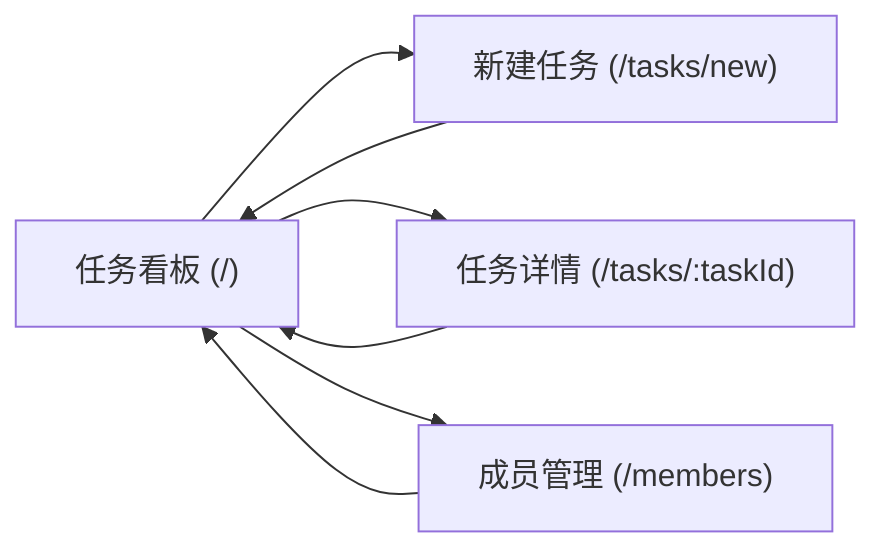

# PRD: Team Tasks

## 1. 概述

Team Tasks 是给一个小团队用的内部任务管理工具。成员在同一块看板上创建任务、
指定负责人、推进状态，并一眼看到团队当前正在做什么。

核心价值：把「谁在做什么」从聊天记录里搬到一个所有人都能刷新到同一份数据的地方。

本轮为 Tier S 演示：单页应用，技术栈未定，不做超出下述范围的扩展。

## 2. 核心功能

#### F001 创建任务

填写标题（必填）与描述（可选），生成一条新任务。

#### F002 分配负责人

从成员名册中为任务指定一名负责人，可改派，可置为未分配。

#### F003 更新任务状态

按 §2.2 的状态机推进任务。

#### F004 团队看板

按状态分列展示全部任务，默认只显示「当前工作」。

#### F005 按负责人筛选与工作量统计

筛选某成员的任务，并显示每人当前工作量。

#### F006 成员名册管理

添加、移除团队成员。

### 2.1 非目标（本轮明确不做）

| 不做 | 理由 |
|------|------|
| 截止日期 | README 未提出；属于新增产品含义，不自行扩展 |
| 优先级 | 同上 |
| 评论与讨论 | 同上；工具定位是状态可见性，不是沟通 |
| 删除任务 | 同上；错误任务可置为未分配并标记完成 |
| 重新打开已完成任务（done → in_progress） | `done` 被定为状态机终态（见 §2.2）。允许回流会使状态机无终态 |

### 2.2 业务规则与状态机

- **VAR-01 当前工作状态集** —— 计入「团队当前工作」的状态集合，默认为
  `todo` 与 `in_progress`
- **RULE-01 成员当前工作量** —— 输入 VAR-01。某成员的当前工作量 =
  负责人为该成员且状态属于 VAR-01 的任务条数

任务状态机（WF-01，实体 Task）：初始态 `todo`，终态 `done`。

| 从 | 到 | 动作 | 执行者 |
|----|----|------|--------|
| todo | in_progress | 开始处理 | 任意成员 |
| in_progress | todo | 退回待办 | 任意成员 |
| in_progress | done | 标记完成 | 任意成员 |

## 3. 页面与屏幕

### 页面路由索引

| ID | 路由 | 页面名 |
|----|------|--------|
| PAGE-001 | `/` | 任务看板 |
| PAGE-002 | `/tasks/new` | 新建任务 |
| PAGE-003 | `/tasks/:taskId` | 任务详情 |
| PAGE-004 | `/members` | 成员管理 |

### 3.1 PAGE-001 任务看板

- **路由**: `/`
- **目的**: 团队的默认落地页，一屏看到所有人当前在做什么
- **布局区域**（上 → 下）
  - Header：产品名 + 「当前成员」下拉 + 「新建任务」主操作 + 「成员管理」链接
  - Toolbar：负责人筛选下拉 + 「显示已完成」开关
  - Sidebar（右侧）：成员工作量列表，每行为「成员名 · 当前工作量」（RULE-01）
  - Body：按状态分列的任务卡片（待办 / 进行中 /（可选）已完成）
- **屏上清单**: 当前成员下拉、新建任务按钮、成员管理链接、负责人筛选下拉、
  显示已完成开关、任务卡片（可点击）、卡片上的状态推进按钮
- **非交互元素**: 列标题与各列计数、成员工作量数字、空态提示文案
- **UI 状态**
  - loading：三列骨架占位
  - empty：无任务时显示「还没有任务，点击「新建任务」开始」
  - error：加载失败时顶部显示错误条，含后端返回的原因
  - populated：正常渲染卡片

### 3.2 PAGE-002 新建任务

- **路由**: `/tasks/new`
- **目的**: 采集一条新任务的最小信息
- **布局区域**（上 → 下）
  - Header：标题「新建任务」
  - Body：标题输入、描述文本域、负责人下拉（含「未分配」）
  - Footer：创建按钮 + 取消按钮
- **屏上清单**: 标题输入、描述文本域、负责人下拉、创建按钮、取消按钮
- **非交互元素**: 各字段标签、标题必填标记
- **UI 状态**
  - loading：负责人下拉在名册加载完成前禁用并显示占位文案
  - idle：表单可编辑，创建按钮在标题为空时禁用
  - submitting：创建按钮进入 loading 且禁用，表单只读
  - error：表单上方显示提交失败原因，输入内容保留

### 3.3 PAGE-003 任务详情

- **路由**: `/tasks/:taskId`
- **目的**: 查看并就地修改单条任务，执行状态转移
- **布局区域**（上 → 下）
  - Header：返回看板链接 + 当前状态徽标
  - Body：标题（内联可编辑）、描述（内联可编辑）、负责人下拉
  - Footer：当前状态允许的转移按钮组（依 §2.2）
- **屏上清单**: 返回看板链接、标题内联编辑、描述内联编辑、负责人下拉、状态转移按钮组
- **非交互元素**: 状态徽标、字段标签
- **UI 状态**
  - loading：字段骨架占位
  - error：`taskId` 不存在时显示「任务不存在」并提供返回看板链接
  - saving：被保存字段禁用并显示保存中
  - populated：正常渲染

### 3.4 PAGE-004 成员管理

- **路由**: `/members`
- **目的**: 维护可被指派的成员名册
- **布局区域**（上 → 下）
  - Header：返回看板链接 + 标题「成员管理」
  - Body：成员列表，每行为姓名 + 移除按钮
  - Footer：新成员姓名输入 + 添加成员按钮
- **屏上清单**: 返回看板链接、新成员姓名输入、添加成员按钮、每行的移除按钮
- **非交互元素**: 成员总数、姓名文本
- **UI 状态**
  - loading：列表骨架占位
  - empty：名册为空时显示「还没有成员，先添加一位」
  - error：读写失败时显示错误提示，含失败原因
  - populated：正常渲染列表

## 4. 交互组件

| ID | 页面 | 组件 | 类型 | 用户交互 | 效果（反馈 + 结果） |
|----|------|------|------|----------|---------------------|
| IC-01 | PAGE-001 | 当前成员 | 下拉选择 | 选择 | 会话身份更新；该成员的任务卡片加高亮边框；筛选不变 |
| IC-02 | PAGE-001 | 新建任务 | 按钮 | 点击 | 按钮进入按下态；导航到「新建任务」`/tasks/new` |
| IC-03 | PAGE-001 | 负责人筛选 | 下拉选择 | 选择 | 列表就地过滤为该负责人的任务；各列计数同步更新 |
| IC-04 | PAGE-001 | 显示已完成 | 开关 | 点击切换 | 开启时追加「已完成」列，关闭时移除该列；不触发重新加载 |
| IC-05 | PAGE-001 | 任务卡片 | 卡片 | 点击 | 卡片高亮；导航到「任务详情」`/tasks/:taskId` |
| IC-06 | PAGE-001 | 卡片状态推进 | 按钮 | 点击 | 按钮 loading；成功后卡片移入目标列，工作量侧栏刷新；失败时卡片归位并弹出错误 toast |
| IC-07 | PAGE-001 | 成员管理入口 | 链接 | 点击 | 导航到「成员管理」`/members` |
| IC-08 | PAGE-002 | 标题 | 文本输入 | 输入、失焦 | 本地更新；为空时失焦显示内联校验「标题必填」并禁用创建按钮 |
| IC-09 | PAGE-002 | 描述 | 文本域 | 输入 | 本地更新；无校验 |
| IC-10 | PAGE-002 | 负责人 | 下拉选择 | 选择 | 本地更新；默认值为「未分配」 |
| IC-11 | PAGE-002 | 创建 | 按钮 | 点击 | 按钮 loading 且表单只读；成功后导航回「任务看板」`/` 且新任务出现在待办列；失败时留在本页显示错误并保留输入 |
| IC-12 | PAGE-002 | 取消 | 按钮 | 点击 | 丢弃草稿；导航回「任务看板」`/` |
| IC-13 | PAGE-003 | 标题 | 内联文本输入 | 输入、失焦 | 失焦即保存；保存中字段禁用；成功显示已保存标记，失败回滚为原值并显示原因 |
| IC-14 | PAGE-003 | 描述 | 内联文本域 | 输入、失焦 | 同 IC-13 |
| IC-15 | PAGE-003 | 负责人 | 下拉选择 | 选择 | 立即保存改派；成功后 Header 与看板工作量随之更新，失败回滚 |
| IC-16 | PAGE-003 | 状态转移 | 按钮组 | 点击 | 只渲染 §2.2 允许的转移；点击后按钮 loading，成功后状态徽标更新，失败显示原因 |
| IC-17 | PAGE-003 | 返回看板 | 链接 | 点击 | 导航到「任务看板」`/` |
| IC-18 | PAGE-004 | 新成员姓名 | 文本输入 | 输入、回车 | 本地更新；回车等价于点击 IC-19 |
| IC-19 | PAGE-004 | 添加成员 | 按钮 | 点击 | 按钮 loading；成功后成员出现在列表且输入框清空；重名时显示内联错误「该成员已存在」 |
| IC-20 | PAGE-004 | 移除成员 | 按钮 | 点击 | 弹出确认；确认后该成员从名册消失，其名下任务负责人变为「未分配」；失败时列表不变并显示原因 |
| IC-21 | PAGE-004 | 返回看板 | 链接 | 点击 | 导航到「任务看板」`/` |

## 5. 交互总览

## 6. 用户流程

主路径「派活并推进到完成」：

1. 成员打开 `/`，用 IC-01 选择自己为当前成员
2. 点击 IC-02 进入 `/tasks/new`，填写标题（IC-08）并用 IC-10 指定负责人
3. 点击 IC-11 创建，回到看板，任务出现在待办列
4. 负责人点击卡片上的 IC-06「开始处理」，任务移入进行中列，侧栏工作量 +1
5. 完成后在卡片（IC-06）或详情页（IC-16）标记完成，任务进入已完成
6. 已完成任务默认不显示，需要时用 IC-04 打开「显示已完成」查看

## 7. 验收标准

| ID | 功能引用 | 标准 | 如何验证 |
|----|----------|------|----------|
| AC-01 | F001 | 标题为空时创建按钮为禁用态，且失焦后标题下方出现「标题必填」 | 在 `/tasks/new` 聚焦标题后直接失焦，检查按钮 `disabled` 与提示文本 |
| AC-02 | F001 | 提交标题「写周报」后回到 `/`，待办列出现标题为「写周报」的卡片，且待办列计数 +1 | 手工走一遍并对比提交前后的列计数 |
| AC-03 | F001 | 创建请求失败时停留在 `/tasks/new`，已填标题与描述原样保留，页面顶部显示后端返回的失败原因 | 模拟接口 500，检查输入框值与错误文案 |
| AC-04 | F002 | 负责人下拉的选项恰为 `/members` 当前名册加一项「未分配」，无其它选项 | 对比 `/members` 列表与下拉选项集合 |
| AC-05 | F002 | 在 `/tasks/:taskId` 改派负责人后，返回 `/` 时原负责人工作量 −1、新负责人 +1 | 记录改派前后侧栏两个数字 |
| AC-06 | F003 | 状态为 `todo` 的任务只出现「开始处理」一个转移按钮；`done` 的任务不出现任何转移按钮 | 分别打开两种状态的任务详情，清点按钮 |
| AC-07 | F003 | 点击「标记完成」后卡片从进行中列移动到已完成列，且不再能被推进到其它状态 | 手工执行一次并复查 AC-06 |
| AC-08 | F004 | 首次打开 `/`（未动 IC-04）时页面上不存在任何 `done` 状态的任务卡片 | 造一条 done 任务后加载 `/`，检查 DOM |
| AC-09 | F004 | 无任务时 `/` 显示「还没有任务，点击「新建任务」开始」，且不显示空的状态列骨架 | 清空数据后加载 `/` |
| AC-10 | F005 | 侧栏中某成员的数字等于「负责人为该成员且状态为 `todo` 或 `in_progress`」的任务条数 | 人工点数与侧栏数字比对 |
| AC-11 | F005 | 选中负责人筛选后，看板上每张可见卡片的负责人均为该成员 | 逐张卡片检查负责人字段 |
| AC-12 | F006 | 添加已存在的姓名时名册条数不变，且输入框下方出现「该成员已存在」 | 重复添加同名成员两次 |
| AC-13 | F006 | 移除某成员后，其原先负责的任务在看板上负责人显示为「未分配」，任务本身仍存在 | 移除有在办任务的成员后刷新 `/` |
| AC-14 | F004 | 成员 A 在设备 1 创建任务后，成员 B 在设备 2 刷新 `/` 即可看到该任务 | 两台设备并行操作一次 |

## 8. 技术约束

- **数据在全体成员之间共享**：任一成员的写入，其他成员刷新后必须可见（AC-14）。
  实现方式（存储介质、是否需要服务端）留给架构阶段决定，本 PRD 不指定
- 支持最新两个大版本的 Chrome、Safari、Edge；不支持 IE
- 看板首屏在 200 条任务规模下的可交互时间不超过 2 秒
- 所有交互控件可用键盘到达，焦点态可见

## 9. 待确认项

每项均已给出默认决策，按默认决策实现不会阻塞下游；若人工裁决与默认不同，
需要回到本阶段修订。

### 9.1 成员身份如何确定

- **默认决策**：不做登录与鉴权。看板 Header 的「当前成员」下拉（IC-01）
  从 `/members` 名册中选择，选择结果只存在于本地会话，仅用于高亮，不构成权限
- **依据**：README 限定本轮为 Tier S 演示；引入鉴权会把项目推到 Tier M，
  与「不自行扩展范围」冲突
- **验收标准**：AC-04（下拉选项集合与名册一致）；任何成员都能修改任何任务，
  见 §2.2 中执行者一律为「任意成员」
- **兜底方案**：若确认需要登录，则重新判定 Tier 并重写本 PRD，不在 Tier S
  骨架上打补丁

### 9.2 共享数据的实时性

- **默认决策**：只保证「手动刷新后可见」，不做自动轮询或服务端推送
- **依据**：没有可引用的延迟要求来源，不自行设定一个看起来合理的秒数阈值
- **验收标准**：AC-14（二元判定，不含时限）
- **兜底方案**：若后续要求实时可见，作为独立功能新增，并同时补一条带明确
  时限的验收标准

### 9.3 移除成员时其名下任务的归属

- **默认决策**：任务保留，负责人置为「未分配」
- **依据**：任务是团队资产，成员离开不应带走工作记录
- **验收标准**：AC-13
- **兜底方案**：若要求改为「移除前必须先改派完毕」，则 IC-20 在该成员仍有
  当前工作时禁用并说明原因
